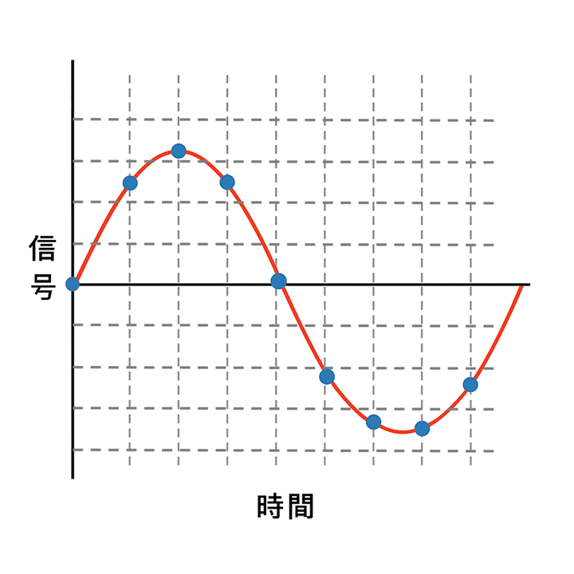
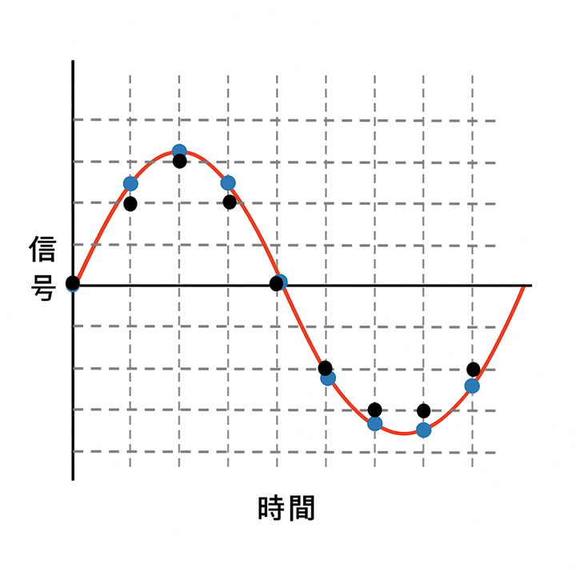
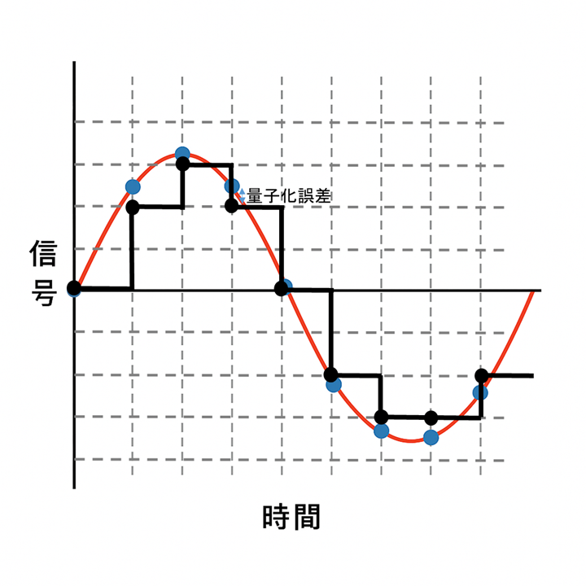

# アナログ値とデジタル値 ~サンプリングと量子化の基本~

データを扱う際の第一歩として、アナログとデジタルの違いを理解することは欠かせません。世の中に存在する多くの物理現象——温度、光、音、電圧、位置など——は本来連続的であり、無限に細かな値をとれる「アナログ値」として存在しています。一方、コンピュータが扱えるのは、0 と 1 に代表される離散的な値だけです。つまり、連続世界の情報をコンピュータに入力するためには、アナログの量を何らかのルールに従ってデジタル化しなければなりません。コンピュータでももちろん小数点を使って細かい値を扱うことはできますが、その桁数も有限であり、本質的なアナログ値を直接扱うことはできません。このアナログからデジタルへの変換を理解することは、コンピュータでデータを扱う上での基本であり、データ解析、信号処理、計測、画像処理など広範な領域において活用されています。

アナログ値をデジタルに変換する中心的なプロセスが **「サンプリング」** と **「量子化」**です。

サンプリングとは、連続時間で変化する信号から、一定の時間間隔で値を取り出す操作です。１日の温度変化を記録するために例えば１時間ごとに温度計の値を読み取ること、これがサンプリングです。またたとえば、オーディオ信号（音楽CDなど）であれば、1 秒間に 44,100 回値を取得する「44.1kHz サンプリング」がよく知られています。サンプリング周波数が高いほど、元の信号をより細かく追従できますが、データ量は増えます。逆に頻度が低いと信号の変化を捉えられず、利用できないものになってしまいます。先ほどの温度の例では、１日の気温の変化を把握するのに、１日１回温度を測定しても意味がありません。逆に、１秒ごとに温度を測定しても、データが増えるだけでやはり意味がないことは直観的に理解できるでしょう。

したがって、対象となる信号の特性（およびデータを取る目的）に応じて適切なサンプリング間隔を選ぶことが重要になります。

{width=50%}

サンプリングでは時間方向に離散化が行われますが、取得した各点の値そのものもアナログ値のままではコンピュータで扱えません。ここで次に必要となるのが「量子化」です。量子化とは、連続的な振幅の値を、あらかじめ定められた段階（レベルの値）として取り込む処理です。たとえば、8 ビット量子化であれば 0〜255 の 256 段階に、16 ビットであれば 65,536 段階に区切られます。各サンプル点におけるアナログの振幅値がデジタルの数値として表現されます。この段階数が多いほど細かな精度を得られ、音響であればよりもとの音に近い音が得られます。こうして、アナログ値は、ある離散的な「数値」に変換されました。

{width=50%}

しかし、量子化には必然的に誤差がつきまといます。本来のアナログ値と実際に割り当てられた量子化レベルとの差を「量子化誤差」と呼びます。量子化誤差は、基本的には ±1/2 LSB（最下位ビットの幅）以内に収まるとされます。これは、どれだけ高精度にしたくても、段階的に値をとる以上、丸めによるズレが避けられないことを意味します。実用的には十分量子化するビット数を大きくすることで元のアナログ値に十分に近い値をとることができますが、それでも真値との誤差をゼロにすることはできません。ある値を8ﾋビットで量子化したとしましょう。このときのアナログ値は128.1だったとすると、四捨五入されて128というデジタル値になりますが、アナログ値で127.5～128.4の範囲はすべて128に丸められてしまいます。音声などでは、信号レベルが急に変わることによるノイズが発生することがあります。

量子化誤差は不可避なものですが、いずれにせよ、こうして、アナログデータはデジタルデータという、コンピュータで扱える形になりました。

{width=50%}

アナログ値をデジタル化する際には、サンプリングと量子化の両方が適切である必要があります。高いサンプリング周波数でも量子化レベルが粗ければ、滑らかさを欠いたデータになりますし、逆に高精度の量子化を用いてもサンプリングが粗いと変化を捉えられません。つまり、デジタルデータの品質は「時間方向の離散化」と「振幅方向の離散化」のバランスに大きく依存します。また、デジタル化は、本質的に不可逆的です。いかにサンプリング周波数と量子化を細かく行っても、ともに離散的なものであるため、完全に元の信号を取り出すことはできません。

現代では高性能な A/D コンバータが容易に入手でき、24 ビット、96kHz の音声入力や、14〜16 ビットの高精度センサ（A/D変換）が一般的になりました。特定の用途では、24ビットといったさらに高精度なA/Dコンバーターや、数GHzを超えるような高速なA/Dコンバーターが手に入ります。しかし、信号（計測対象）の性質や必要なデータの頻度/分解能などによって、その「最適な組み合わせ」は常に異なります。データ解析や計測の現場では、ただ高精度だから良いというわけではなく、目的に応じて十分な情報量を確保しつつ、過剰なデータ量や誤差の影響を避ける設計が求められます。

さて、一度アナログデータをデジタル化してしまえば、そのコピー自体はは簡単です。また、画像処理などにも代表されるような、加工も簡単にできます。これが、デジタルデータを扱うことの最大のメリットです。

アナログとデジタル、サンプリングと量子化の理解は、データの取り扱いを正しく行うための基礎そのものです。本章では、デジタル化の基本についてごく簡単に述べましたが、昨今ではこういったことを意識せずとも、PCだけでなくスマホやオンラインサービスを利用することができます。世の中のほとんどのことは、デジタルデータとして存在するようになりました。とはいえ、これらの基本的なことを押さえておくことで、圧縮やデータの活用といったところにも目が向くことでしょう。

ここで述べたのは、アナログ信号のデジタル化（デジタイズ）の基本中の基本の部分です。より詳しくは、サンプリング定理、といった内容で検索してみてください。ノイズの問題など、とても奥の深い世界が広がっていますよ。