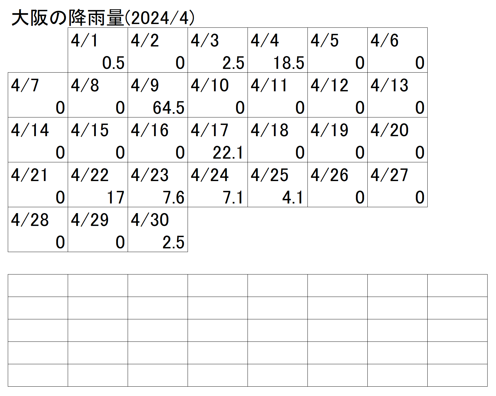
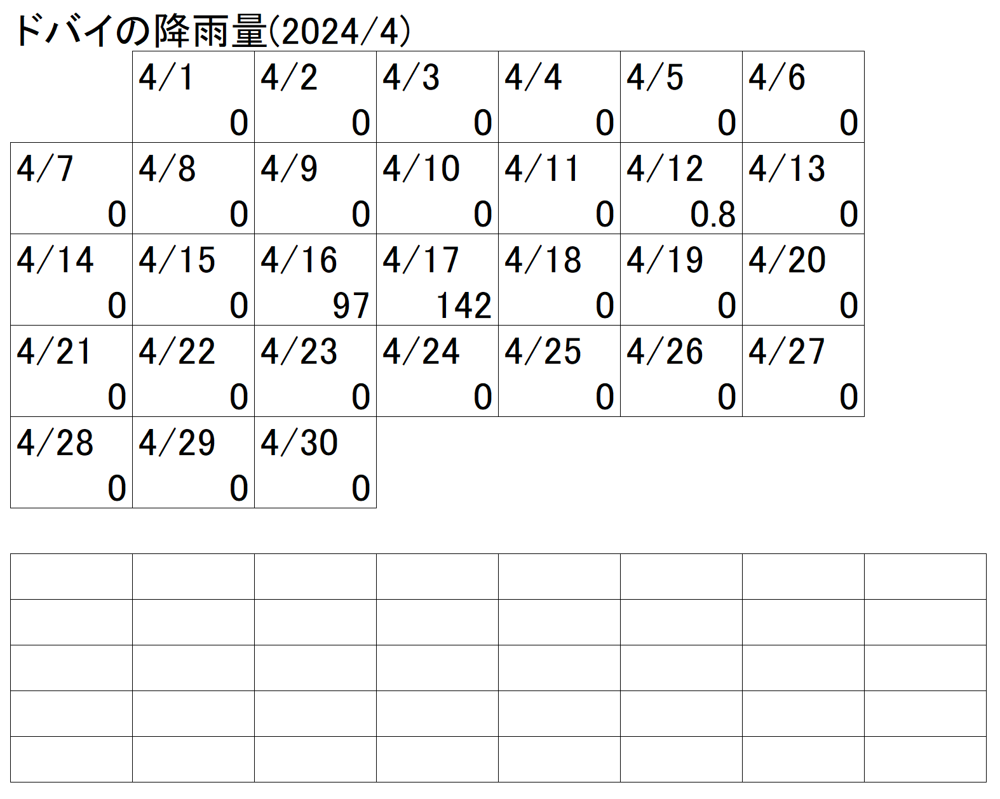
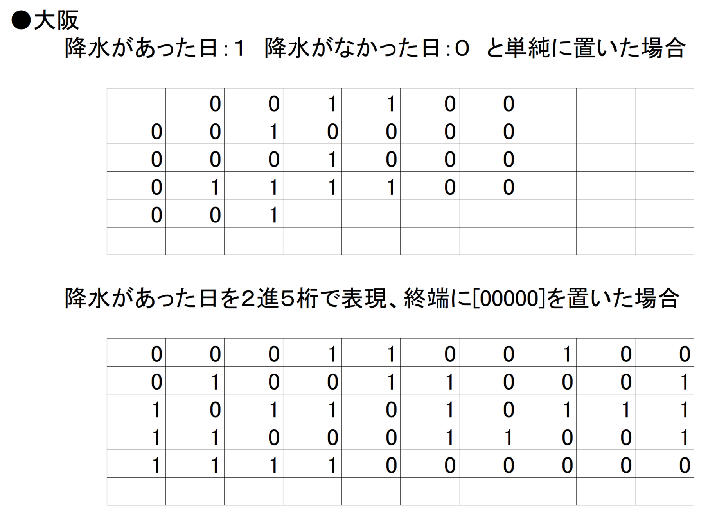
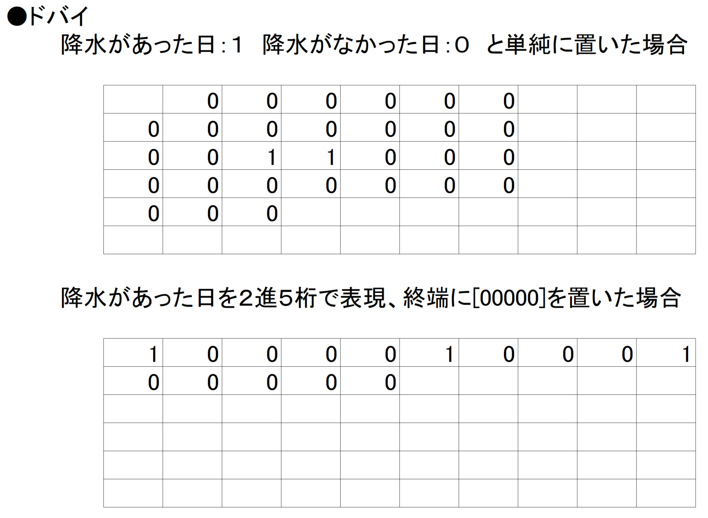
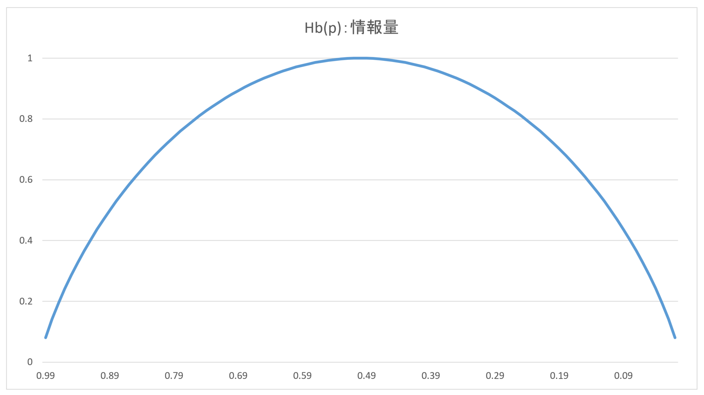
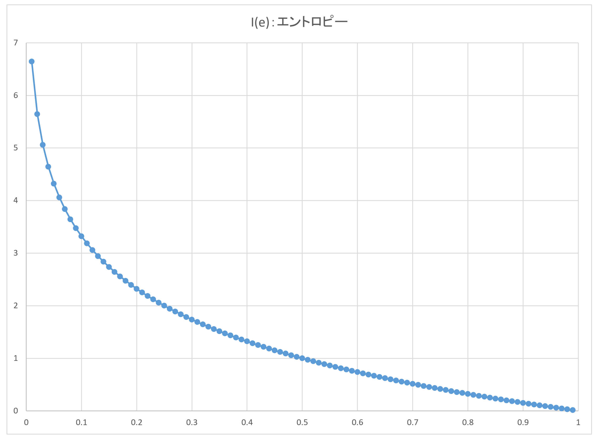

# 「データ」再入門

この合同誌は「データ」および、「データに関するマネジメント」についての本なので、まずはデータとは？　みたいなところを改めておさらいしていきましょう。

知らない人はせっかくなので学んでみてください。

## 「データ」と「情報」

現在では情報Ⅰが大学共通テストの科目に入りましたが、高校で教えている「データ」、「情報」、「情報処理」の定義は次のようになります。

| 用語 | 定義 |
| ---- | ---- |
| データ | 事実や数字、記号、記録など、**意味が解釈されていない状態**の値や文字列 |
| 情報 | データを情報処理し、**データに意味や文脈を加えて**、理解や知識、判断材料になる状態にしたもの |
| 情報処理 | データを集めて、**整理・分析・加工して情報に変える**作業 |

具体的な例をあげると、たとえば「今日の最高気温は15℃でした。」という内容は、たんなるデータです。

これが例えば「昨日の最高気温は20℃で、今日の最高気温は15℃でした。」であれば、昨日より5℃寒くなっている事がわかります。また、「例年の平均最高気温は10℃で、今日の最高気温は15℃でした。」であれば、例年より5℃暖かかった事がわかるわけです。

実際私たちも、例えば温度計を見た時には「15℃」と表示されていても、「昨日より寒いな」とか、「例年より温度高いな」と考えて、たとえば服装をきめたりしているはずで、これは**無意識のうちにデータを情報に変換している**ということになります。

これらを踏まえると、単なるデータ１つだけではデータの範囲を脱しないのですが、これに対して比較対象を示したり、時系列で並べたり、統計的手法を用いる事で、データは情報になる　と言えそうです。

ただし、そもそもの「データ」についても様々な形で表現する事ができます。

具体的な例を挙げて、まずは「データ」表現について振り返ってみましょう。

## 例題を解いてみて、「データ」の理解を深めよう

次の２つの都市の資料[^Metrostat]を元に、それぞれの都市での**1ヶ月の天気（降水の有無）をデータとして表現**(つまり表現には0/1しか使えません)して下さい。

[^Metrostat]: 引用：Metrostat(https://meteostat.net)

なお、気象庁が降水確率として置いている定義は、「予報区内で一定の時間内に1mm以上の雨または雪（融けたときの降水量に換算する）が降る確率」なので、これに沿って下さい。

※各画像の下側のマトリクスに、データを表現してみましょう。

どうなったでしょうか？

なお、書き方としては大きく２つあり

* 常に同じ情報量となる表現方式
* 内容によって情報量が変わる表現方式

があります。

それぞれの表現方式で大阪の降水量を表現すると、次のようになります。

{width=80%}

またドバイの降水量を表現すると、次のようになります。

{width=80%}

## 簡潔に「情報」や「データ」を表現しようとすると表現方法で有利不利が出る

実際に演習をしてみて、表現例をみると気付けるのですが、情報を短く表現しようとした時

* 単純に1日1ビットでの表現が有利なケース
* そうじゃない表現が有利なケース

があることがわかりました。なぜこういった事が起きるのでしょうか？

もう少し論点をわかりやすくするために、1bitの情報について考えてみましょう。

仮にコインを投げて、表が出るか裏が出るかの確率はどうなるでしょうか？　より具体的には例えば、100回コイントスを試行して、表裏の結果を記録したい場合、どう表現すべきでしょうか……？

この結果としては、コインの重さが表裏で均一であるならば出現確率は50:50になり、かつランダムになります。

なお、この情報を素直に表現する場合は100ビット並べて記録する形が最もシンプルでかつ効率が良い事がわかっています。

先程の例題で、大阪とドバイの降雨の有無を表現してもらいました。この発生確率はどうだったでしょうか？

実際に発生確率を表に示すと、次のようになります。

| 都市 | 晴 | 雨 |
| ---- | ---- | ---- |
| 大阪 | 21（70%） | 9（30%） |
| ドバイ | 28（93%） | 2（ 7%） |

具体的に割合で見てみると、大阪の発生確率もコイントスに比べると結構偏りがあるが、ドバイはより偏りが顕著であることがわかります。

そして、ドバイの方が表現方法によってはより簡潔に情報を表現する事ができました。

## 「データ」の偏りとエントロピー

実は情報の情報量というのは、偏りがある情報はトータルすると情報量が少ないことがわかっています。

細かい話を言うと、自己情報量は"-log P(E)"で表されるだとか、ベルヌーイ試行のエントロピーは"-p log p-(1-p)  log (1-p)"で表されるだとか　という話があるのですが、要点だけをざっくり説明すると、次のグラフのようになります。

まず、次のグラフは横軸が発生率、縦軸が情報量です。0/1が平均的に発生すると、1ビット当たりの情報量は1ビットになります。発生率が1に近づくにつれて、現象としてはありふれてしまうので情報量は少なく、発生率が0に近づくにつれて、現象としては貴重になるので情報量は多くなります。

これは例えば、いつでもずっと「店じまいセール！」と張り紙をしてセールをしているお店だと、「店じまいセール！」のインパクトはほぼ無いですが、普段はちゃんと営業していたのに閉店する事になり「店じまいセール！」を掲示したお店だとインパクトが大きい　といった現象と同じであると言えます。

{width=50%}

そして、発生率とその発生率を反転させたもの（1が出る確率に対しての0が出る確率）に対し、それぞれの情報量を足してプロットし、グラフ化すると次のようになります。発生率が0.5となるケースが一番情報量が多い事がわかります。

※ちなみに１bitあたりに持つ、実情報量をエントロピーと呼びます

{width=50%}

情報に偏りがあると、情報量が少ないことがわかる例を、具体的にもう１つ挙げてみましょう。

たとえば居酒屋で、4人組の人が「ファジーネーブル、日本酒、ウイスキーロック、生ビール」を頼むのと、「とりあえず生４つ」を頼むのは、比べてみるとどうでしょうか。

「とりあえず生４つ」の方が簡潔です。これは丁寧に説明すると**情報に偏りがあることで、情報量が少なくなっており情報が圧縮でき、その結果として注文が簡潔**なためです。

## 「データ」の圧縮

ここまでの説明で、「データ」の可逆圧縮についても説明ができます。

可逆圧縮は、情報量が少ない(符号化した情報に偏りが発生する)表現方式から、より情報量が多い(符号化した情報がランダムに近くなる)表現方式に符号化を置き換えてやると、情報が欠損せず　かつ表現に必要な情報量を減らす事ができます。

ですので、例えば次のような事を手元で試してみると情報の圧縮について、より具体的なイメージを持てるでしょう。

* jpeg形式の画像とbmp形式の画像をそれぞれzipなどの圧縮ファイルにて圧縮し、サイズの変化を見てみるとどうでしょうか？
* zip形式で圧縮されたファイルを更にzip形式で圧縮し、サイズの変化を見てみるとどうでしょうか？

## おわりに

この章では、データを取り扱う上での基礎理論となる情報理論について、実際のデータやグラフを元にできるだけ平易に説明してみました。

情報理論についてはコンピューターサイエンスをメインとした大学の講義が、これだけで数コマ成立するというレベルの深い論点なので、気になった方は更に掘ってみてください。
