# 物理と「情報」と「データ」

今更感はありますが、改めて基礎に戻ってみましょう。

コンピューターの大原則は

* 情報を入力して
* 情報を処理して
* 情報を出力する

ものです。

具体的な例としては次に挙げるような、いわゆる「コンピューターの五大装置」があります。

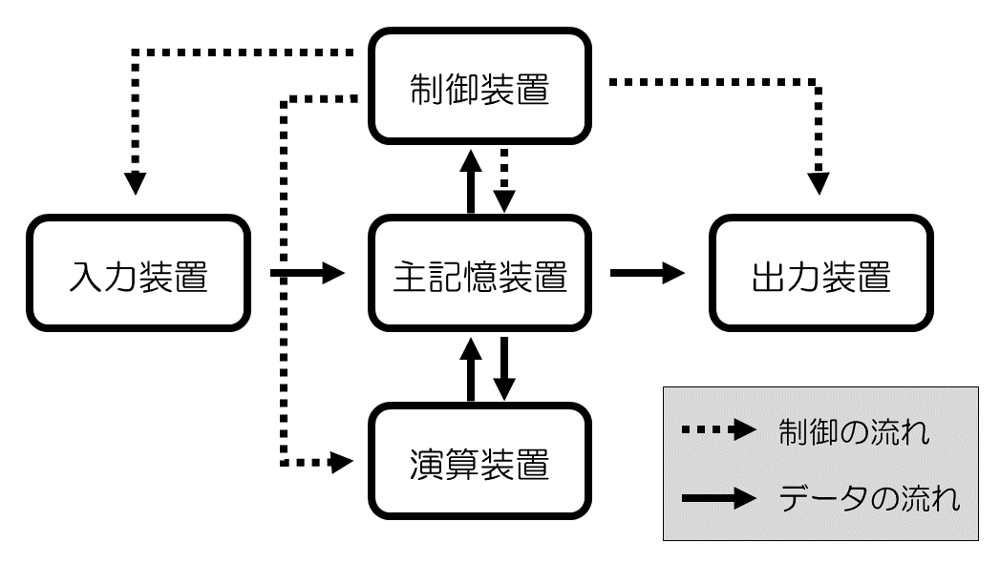

それぞれの装置に関する用語説明は次の通りです。

| 用語 | 説明 |
| ---- | ---- |
| 入力装置 | プログラムやデータを外部から取り入れる装置 |
| 制御装置 | 記憶装置(主記憶装置)に記憶されている命令の読み込みと解読を行い、各装置に指示を出す装置 |
| 記憶装置 | コンピュータ内部でデータやプログラムを記憶する装置 |
| 演算装置 | 数値の計算や大小の比較判断を行う装置 |
| 出力装置 | 処理結果やメッセージを外部に伝える装置 |

## 状態を表現すること：「ストレージ」と「通信」の根底に広がっているもの

さて、先ほどの

* 情報を入力して
* 情報を出力する

は、物理の世界とITの世界の接続点になるわけですが、接続点の先の「物理」が

* 人
* 永続的に状態を維持できるもの
* 遠くに状態を維持したまま飛ぶもの

だとどうなるでしょうか？

「人」との接続点の先にあるのは、すなわち「ヒューマンインターフェース」になります（このトピックは、本誌の主題とはズレる為これ以上は触れませんが）。

### 値を記録・表現するとは？

「永続的に状態を維持できるもの」(※たとえば磁性体)との接続点の先にあるのは「ストレージ」です。

「遠くに状態を維持したまま飛ぶもの」（※たとえば光・電磁波）との接続点の先にあるのは「通信」です。

つまり、「ストレージ」と「通信」には非常に似通った論点が多くあることがわかります。

 

ストレージにせよ、通信にせよ、基礎の奥底には**1bitをどう物理の世界に表現するか**があります。

まずはストレージでの情報の保管と、通信の変調を例に簡単に説明しましょう。

ストレージだと、たとえばハードディスクの基本的な構造は、プラッタ（円盤）に磁性体が塗られており、ヘッダで磁性体の向きを揃えて記録、その向きを読み込みます。ごく簡単に言うと、N極なら0、S極なら1といった具合ですね。

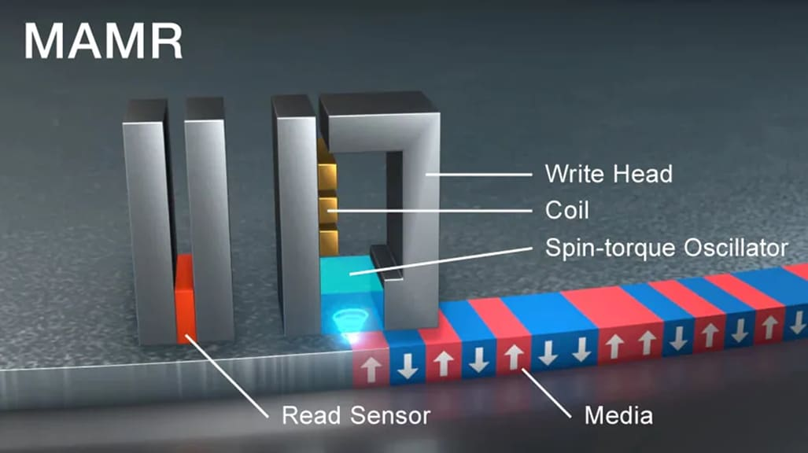

引用：https://www.tdk.com/ja/news_center/press/20220107_01.html

 

通信でも、基礎的な変調方式(ASK:Amplitude Shift Keyingや、FSK:Frequency Shift Keying)では信号の有無や、信号周波数の切り替えで変調を行います。

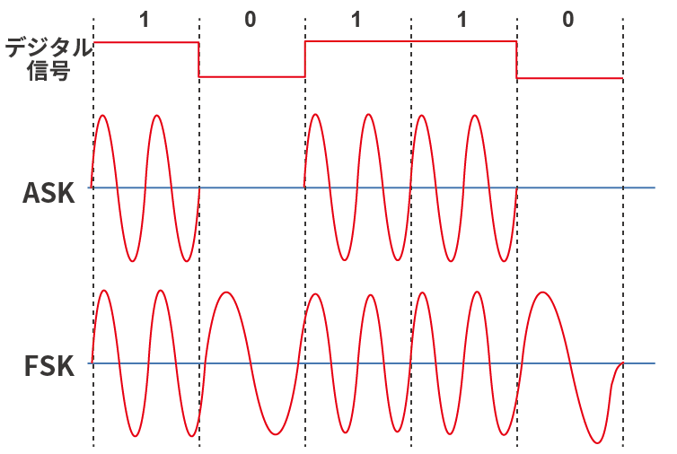

引用：https://www.rohm.co.jp/electronics-basics/wireless/wireless_what3

※なお「A」とか「F」はラジオのAM・FMと同じです。

 

さて、ここまでの例は1bit(2状態)を持てる、物理的な何かで情報を表現していました。

これを、より多い状態(nbit:2^n状態)を持てる物理的な何かで表現するとどうなるでしょうか？

1素子に複数状態を持つストレージ素子でいうと、NANDフラッシュメモリが実用例としては一般的です。

引用：https://www.logitec.co.jp/data_recovery/column/vol_002/

 

まずはNANDフラッシュメモリの動作について見ていきましょう。

NANDフラッシュメモリの構造としては、次の図のようになります。

上から2つ目の箇所である「フローティングゲート」に電荷を溜めたり、電荷を放出したりして状態を記憶します。

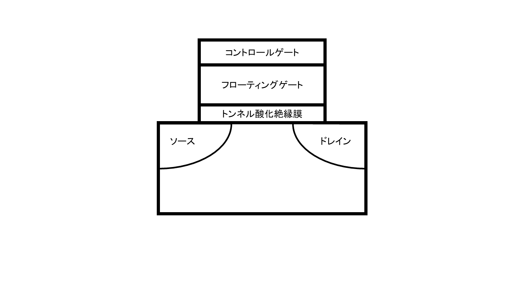

### フラッシュメモリにおけるデータ書き込みの例

データを書き込むには、コントロールゲートに高めの電圧を加えて、フローティングゲートに電荷を溜めます。

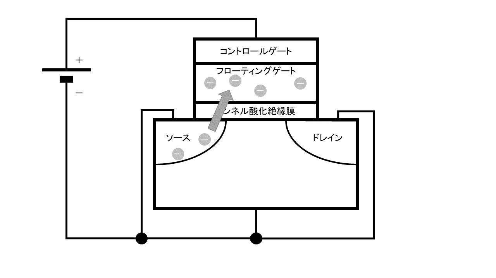

また逆に消去するには逆向きの電圧を加えて、電荷を放出（電子を押し出）します。

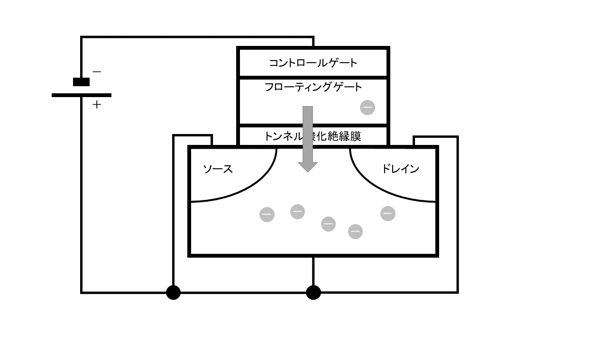

また、フローティングゲートに溜められた電荷（電子）はちゃんと長い期間、安定して保持される性質があります。

### フラッシュメモリにおけるデータ書き込みの例

データを読み出すには、ソースからドレインに電流を流してみます。

この時、フローティングゲートに電子がある場合には電流が流れにくく、

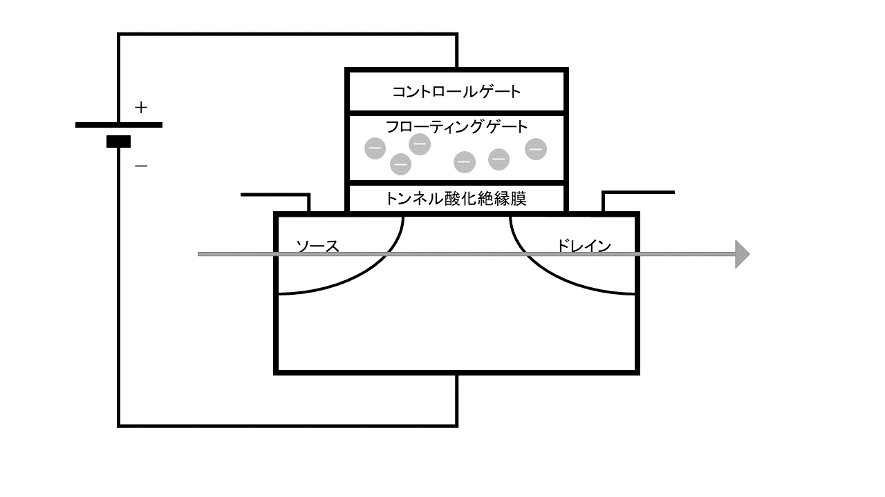

フローティングゲートに電子がない場合には電流が流れやすくなります。

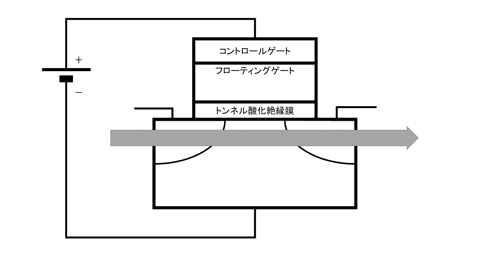

この電流量の差を検出して、データを取り出す事ができます。

また、データを取り出しても、原則フローティングゲートの状態（電荷量）が変わらない事がポイントです。

### フラッシュメモリにおけるセル

この貯める電荷の量をある/なし の2状態とするのがSLC(シングルレベルセル)、4状態だとMLC(マルチレベルセル)、8状態だとTLC(トリプルレベルセル)、16状態だとQLC(クアッドレベルセル)と呼びます。

なお、QLC(クアッドレベルセル)モジュールは2024年頃から量産が開始されています。

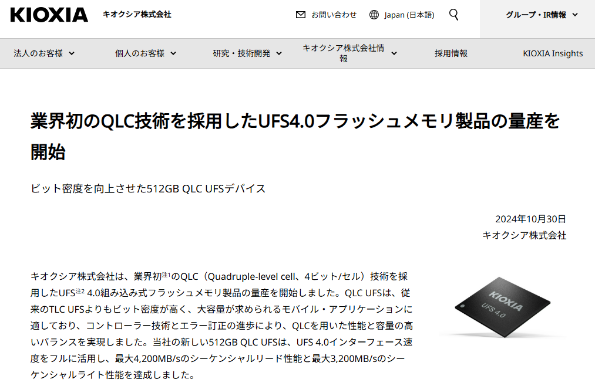

引用：https://www.kioxia.com/ja-jp/business/news/2024/20241030-1.html

### 物理(電子工学)の大事な話をしよう

そもそもの話として、どんな絶縁体であっても電荷の高低差がある場合、微弱であっても電気は少しずつ流れていくものです。

中学理科のレベルの話ではありますが、オームの法則は「V = I × R」です。日本語で書くと「電流は電圧に比例し、抵抗に反比例する」なのですが、要はいくら反比例したとて、抵抗が無限大なわけではないので**電荷の違いがあると電流は微弱ながらも少しずつ流れます。**しかも**半導体なのでそこまで抵抗値が劇的に高いわけでもありません。**

すると、SLCであれば「電荷のある/なし」で状態を表すので、なんとなく長期間のデータ保存にもそれなりに堅牢性がありそうですが、MLCより多くの状態を持つフラッシュメモリセルの場合、電荷の量が減るに従ってデータの値が変わってしまいそうな気がします。

これは実際に起きる現象であり、フラッシュメモリデバイスについては1年ぐらい通電していないと、記録されているデータの内容が保証されない　という特性がわかっています（なので、実際に長期間保存するという前提で、通電状態でない形で保管したいもので用いるストレージであれば、磁気的にデータを蓄積できるデバイス、例えばHDDなどを用いるのが望ましいでしょう。逆にNASなどで用いるため、常時通電が保証されているストレージに用いるのであれば、この論点においてはSSDとHDDは遜色なく用いる事ができます）。

## 通信についても多値化が進んでいる

データの保存とは少し違う論点となりますが、せっかくなので通信についても考えてみましょう。

昨今の無線や有線の通信だと、4状態(2値)までは前述のFSK(4値FSK)が最初採用されていましたが、この頃にQPSK(4位相遷移変調)が出てきて位相変調が主軸になりました。

その後、位相に加えて振幅も含めたQAM(直角位相振幅変調)が現在の主流となっています。

QPSKの例だと次のようになります。符号毎に90度ずつ信号の位相がズレているのがポイントです。

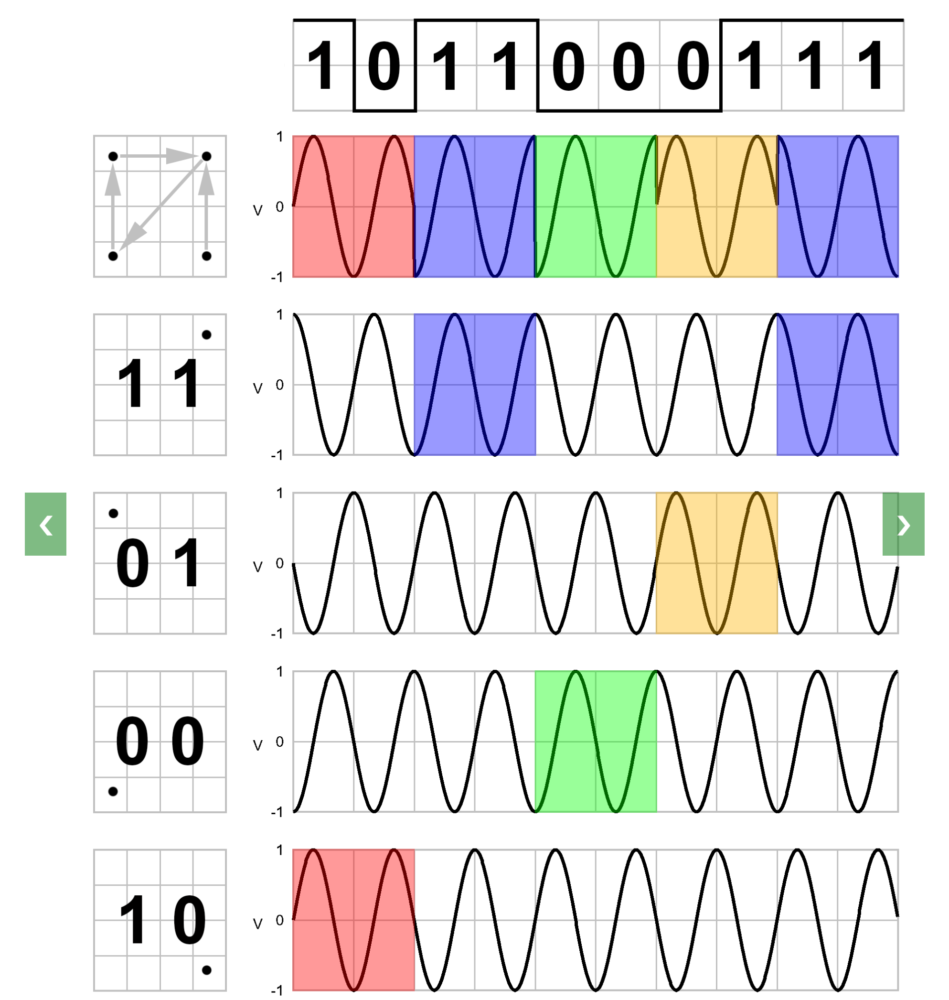{width=50%}

引用：https://www.etti.unibw.de/labalive/experiment/qpsksignalgeneration/

 

4QAM～64QAMの例だと次のようになります。もう何がなんやらという感じですね。

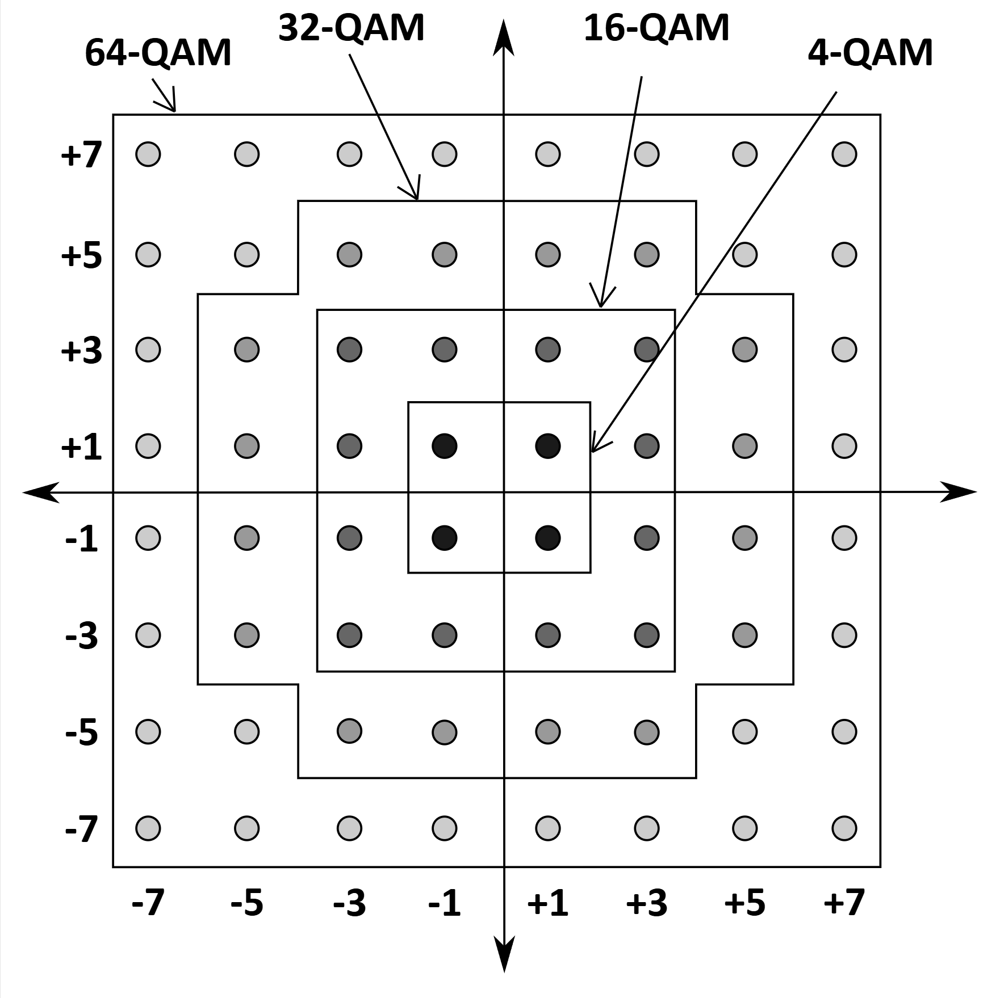{width=50%}

引用：https://en.wikipedia.org/wiki/Quadrature_amplitude_modulation

 

 

 

 

余談：なぜここまで無茶な事してデータの密度増やしてんの？

これは、コンピューターのリソースは指数的に増える(※ムーアの法則 18～24ヶ月で2倍)のですが、ストレージや通信容量は普通の進歩だと線形的にしか容量が増えず、指数的には増えない(増やせない)という特性があります。

ですがコンピューターのリソースは指数的に増えるので、ストレージや通信分野も頑張って追っかけないとそこがボトルネックになってしまう……　という事情があるようです。

## おわりに

この章では、データを伝送したり、保存したりする時に絶対でてくる物理レイヤーを含めたデータについての各種論点を、できるだけ平易に説明してみました。

ITや、その中でもソフトウェアレイヤーの技術だけに向き合っているとあまり触れる機会がない、物理レイヤーの論点ですが、どんなソフトウェアや通信も、物理レイヤーの上に載っている　という点は意識しておかないと、ごく稀にですが足を掬われるケースがあるような気がしています（とはいえ昨今はクラウドがあるので、クラウドにそこら辺を託してしまえば完全に逃げられる時代にはなりましたが……）。

物理層もちゃんと掘ってみると非常に面白いので、ぜひ興味がある人は学んでみると得るものがあるのではないか？ と思います。
