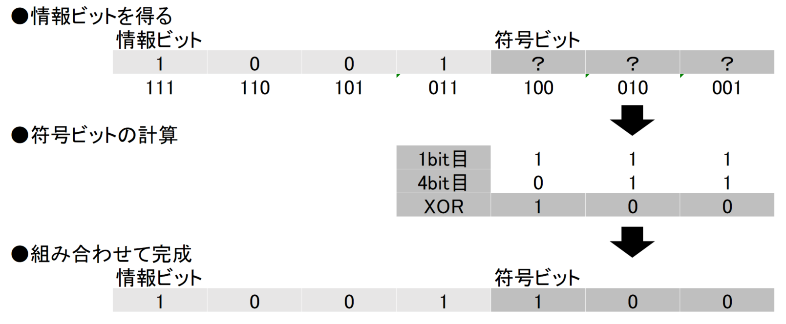
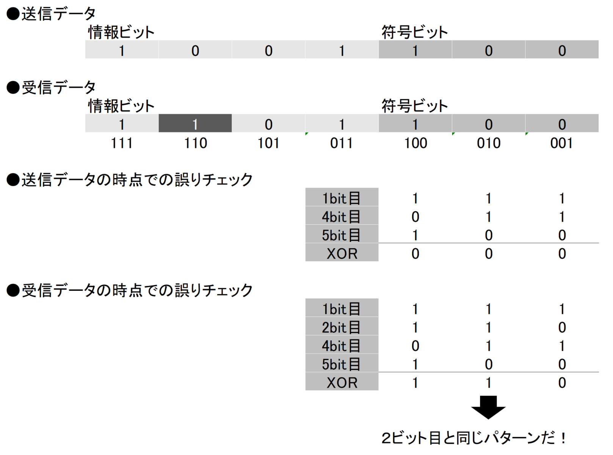
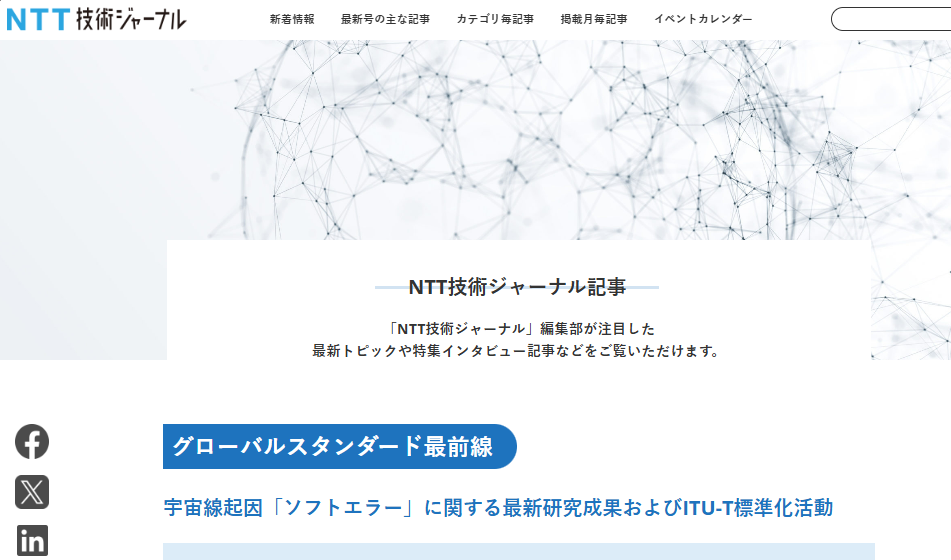
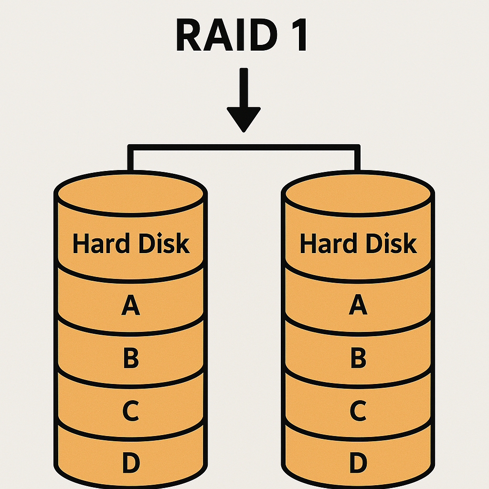
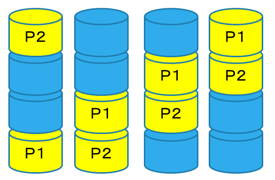
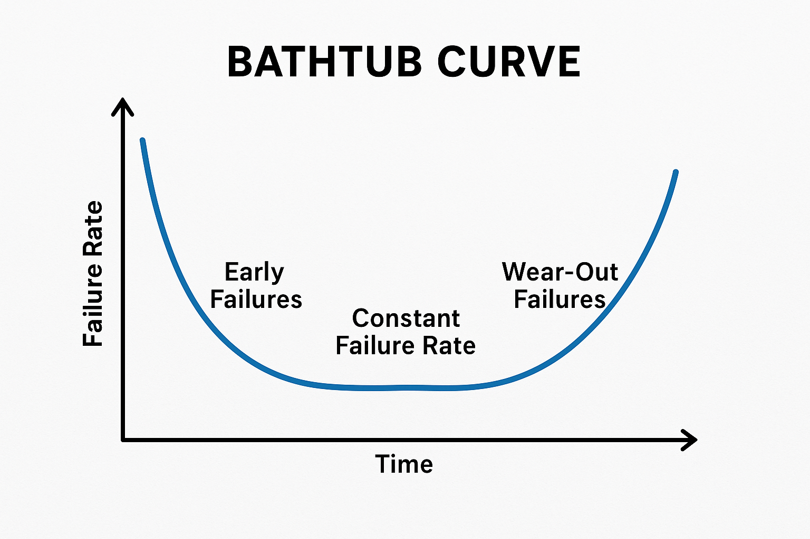
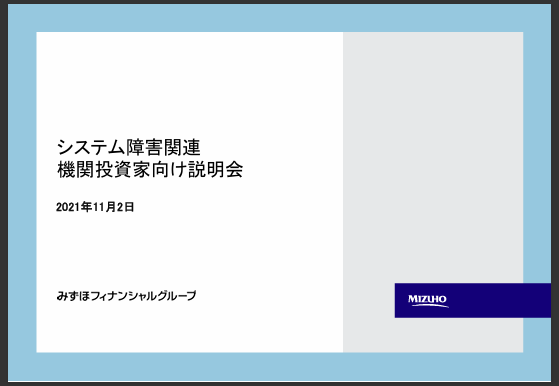

# ストレージ容量や通信容量が増えると何が嬉しいのか

ストレージ容量や通信容量を増やすと、単に保存したり、通信したりするデータ量が増えるのですが、この**増えたデータ量**を**データを守る事に振り分けると、データを守る**事ができます。

この**データを守る** 技術についても基本論点を押さえておきましょう。

## データを守ろう　その１(パリティ)

データを表現するのに最低限必要なbit数に対し、そのbit数より多いデータ量を割り当てる事でデータを守る事ができます。

まずは簡単な例（パリティ）を見てみましょう。

たとえば8bitのデータ[10101010]があるとして、ここに1bit追加します。この時、追加する1ビットはすべてのビットの総和が奇数であれば1、偶数であれば0とします。

上の例だと総和は4なので、9bitになったデータは[101010100]となります。

これは一般的に「偶数パリティ」と呼ばれる**誤り検出ビット生成方式**で、中身がどんなbit列であっても、偶数パリティを含めると全ビットの和は常に偶数になります。

※逆に、常に奇数になるようにする奇数パリティもあります。またどちらのパリティ設定になっているのかは、あらかじめ決めておく必要があります。

前述の9bitのデータ[101010100]の5ビット目に通信誤りが発生した[1010**0**0100]とします。

偶数パリティであるにもかかわらず、ビットの総和は奇数になり、矛盾が生じるため、「どこかに」誤りがある事がわかります。

ただし、この方法では、どこに誤りがあるのかまではわかりませんので、訂正はできません。また、2ビット以上に誤りが発生すると誤り検出できない(誤りがあるのに、無いとしてしまう)ケースが出ます。

## データを守ろう　その２(ハミング符号)

もっと高度な方法もあります。その代表例がハミング符号です。

今度は4bitのデータ[1001]に3bitを次のルールで足してみます(下図の例だと[100])。

引用 https://emb.macnica.co.jp/articles/13232/

すると、1bitのビット誤りが発生しても誤りを自ら訂正できます(これをハミング符号と呼ぶ)。

なお、前述のパリティビットとハミング符号を組み合わせた、拡張ハミング符号が通信の世界では現実的には良く用いられています。

最近まではデータ通信やストレージで・サーバー用メモリでの採用が主だったのですが、最新のデスクトップPCで採用されているDDR5メモリ規格からは、メモリにもこれらの技術で紹介した誤り訂正を応用した、誤り検出・訂正機能(ECC)が必須となっています。

特に信頼性が必要とされるサーバーなどはともかく、誤り検出・訂正機能はこれまで搭載されていなかった一般的なPCのメモリに対し、なぜ昨今急に必須となったかというと、半導体プロセスが微細化した現在では、**宇宙線に起因する「ソフトエラー」が有意に観測されてしまうため**だそうで、例えば次のような記事が公開されていたりします。

{width=50%}

参考　https://journal.ntt.co.jp/article/17465

従来は、メモリセルがある程度の体積を持ち、そこに保持される電荷がある程度大きかったため、宇宙線により生じる電荷では簡単にビット反転が起こらなかったのです。ところが最近のデバイスの微細化により、1セルの体積が小さくなり保持される電荷が小さくなったため、簡単にビット反転してしまうようになった、と感覚的に理解することができます。

データを表現するビット以上の冗長なビット数を誤り検知・訂正に割く事で、**何ビットまでのビット誤りが検知でき、何ビットまでのビット誤りが訂正できるか**というのは、一応理論的にも説明ができるのですが、その話を深堀りする事にはあまり意味がないので、本書の記事としては割愛します。

とりあえず利用者観点としては、**誤り訂正にビットを使えば使うほど、誤り訂正能力が上がる**事だけがわかっていれば良いでしょう。

## データを守ろう　その３(トランザクション)

単一の「データ」をより多くのbit数で守る方法についてはここまで説明してきましたが、それ以外にも「データ」を守るためには、気にしないといけないポイントがあります。例えば次のようなケースを考えてみましょう。

A株式会社の会計担当のＹさんは、Ｘさんに費用を支払おうと5000円を送金しました。

この時の処理は

１）A社口座から	-5000円

２）Xさん口座に	+5000円

という処理になります。

この時、送金の途中（1が終わった時点）でもし送金システムがクラッシュしてしまった　と仮定するとどうなるでしょうか？

普通に考えると、こうなりそうです（5000円消えちゃう……）。

A社口座：▲5000円

Xさんの口座：±0円

こういった事態を防ぐために、この時の処理は１，２を同時に行い、両方が終わったタイミングで処理を止め、データを確実に保存する（もしくは両方を巻き戻して開始していない状態で止める）という事をします。

これをトランザクションと呼びます。

データを守るためのソフトウェアの代表格であるデータベースにおいて、トランザクション処理では、次の４つの基本的な特性を保つ必要がある事が知られています。

| 用語 | 説明 |
| ---- | ---- |
| Atomicity(原子性) | すべてのトランザクションが完全に成功するか、失敗するかを保証する |
| Consistency(一貫性) | トランザクションの実行前後でデータベースの整合性が保たれることを保証する |
| Isolation(独立性) | 同時に実行される複数のトランザクションが互いに影響を与えないようにする |
| Durability(永続性) | トランザクションが完了すると、その結果が恒久的にデータベースに保存されることを保証する |

これだけを見ると、ITだけの世界の話に見えますが、例えば現実的な例でいうと複式簿記なんかも考え方としてはトランザクションの一種だと言えます。なぜかというと、複式簿記の記帳は絶対に貸方と借方をセットでバランスするように書くからです。

なおこれを守れないと、貸借対照表(B/S)・損益計算書(P/L)がバランス(※これらの書表の左右の合計値が一致すること)しなくなります。

## データを守ろう　その４(RAID)

ストレージデバイスを複数組み合わせる技術としてRAID（レイド）とよばれるものがあります。
これが書かれた論文で定義された「RAIDレベル」というのが今でも一般的にRAIDの区分になっています。
※当該論文はRAID5を示すためのものだったので当初はRAID5まで

　

データの堅牢性を上げ、かつ実際に使われているのはRAID1,5,6なので、これらについても説明します。

#### RAID1

※１台壊れても大丈夫 2台必要。

RAID1は単に2台のハードディスクに同じデータを書き込むだけです。シンプル。

#### RAID5

※１台壊れても大丈夫　3台必要。

RAID5は3台以上のハードディスクの領域をある程度のブロックに分割し、ブロック毎に1つがパリティになるように、かつパリティブロック(下図の[P]と書いてある箇所)をストライプ状に配置します。

#### RAID6

※２台まで耐える　4台必要。

RAID6は4台以上のハードディスクの領域をある程度のブロックに分割し、ブロック毎に2つがパリティになるように、かつパリティブロック(下図の[P1,P2]と書いてある箇所)をストライプ状に配置します。

### RAIDの落とし穴

一見、堅牢になっているように見えるRAIDですが、次のような落とし穴もあります。

　

* 構成によっては別の単一障害点(SPOF)が発生する

たとえばRAIDはハードディスクやSSDなどのストレージデバイスについては冗長化できますが、その代わりにRAIDをコントロールするためのチップやカードなど、RAIDを構築するために新たなパーツが必要となる事があります。このパーツが故障したときにデータは保持できるでしょうか？（RAID1は単にミラーリングしているだけなので、ストレージとしてつなぎ直せば原則読めるはずですが……）

　

* ハードディスクやSSDは同じタイミングに同じ所から買うと、同タイミングで故障しやすい

ハードウェアの稼働時間と故障率については一般的に「バスタブ曲線」と呼ばれるものが知られています。

これは、縦軸を故障率、横軸を稼働時間にとってグラフを描くと、**グラフの軌跡がバスタブのように見える**事からこうよばれており、あらゆるハードウェアはこの曲線にそった故障率となります。

で、同タイミングで購入したハードディスクやSSDは、基本的に同じロットや近いロットにどうしてもなりやすく、それらのストレージデバイスを同タイミングから使用開始すると、同じ時期に故障率が上がってきてしまい、**RAIDでストレージが1つ故障してストレージを入れ替えて復旧している間に他のストレージが故障してしまう**といった現象が発生する事があります（しかも結構あるあるだったりします）。

この事象を回避するには、例えばですが**数千時間可動したら意図的にストレージを1本外して予備のストレージを刺し、RAIDを再構築させる**損耗率コントロールや、事前にストレージを動かしてエージング(※初期故障しそうな時間分あらかじめ稼働させて、初期故障させてしまう事)しておくさい、エージングの時間を意図的に変えて損耗状態をバラバラにする、などといった信頼性工学に基づくアプローチが必須となります。

　

* 最新のデータしか守れない

RAIDは**ストレージデバイスの損傷に対しての打ち手なので、現在のデータを正しく守る　という点については強固になる**のですが、例えば「誤操作によりデータベースに誤った値を設定してしまった」であったり、「ランサムウェアに感染し、必要なデータファイルが読めなくなってしまった」といった事象に対しては無力です。

実はRAID以外にも、バックアップのアプローチというのは色々あります。それらについては次節で確認していきましょう。

## データを守ろう　その５(バックアップルール)

「データ」を守るための様々なトピックをだいたいお伝えできたので、やっとバックアップの話に入ります。

バックアップには3-2-1バックアップルールが必要である　と言われて久しいのですが、基本となっているこのルールについてまずは押さえていきましょう。

### 3-2-1バックアップルールの「3」

３は「本番用コピーを含め、少なくとも3つのデータコピーを用意すること。」です。

これは、単に１ペアでのバックアップ(※たとえば前述のRAID1など)だと、「誤りがある事はわかるが、正しいデータが何かはわからない」為、３つのデータコピーを容易するべきとされています。。

※３つあれば２つは一致するはずで、多数決で正しいデータがわかるという事です。

### 3-2-1バックアップルールの「2」

２は「テープとクラウドストレージのように、少なくとも2つの異なるストレージメディアを使用すること。」です。

これは、複数のストレージメディアを使用することで、特定のストレージメディアを使ったときにそこが単一障害点になるケースを防げる(と言われてます)

※聞いたことのある事例では、RAIDコントローラーチップが変に壊れて、正常に動いているふりをして異常データをドライブに書き込み続けたケースや、(ソフトウェアバグ起因で)一定時間稼働すると間違いなく死ぬストレージといった話があります……

バグが無いハードウェアやソフトウェアというのは基本的に無いものと思っておき、複数の手段でデータを守るようにしましょう。

### 3-2-1バックアップルールの「1」

１は「少なくとも1つは、マシンが物理的に破損した場合に備えて、オフサイトで保管すること。」です。

DR(ディザスタリカバリ)やBCP(事業継続計画)的な文脈ですが、この「オフサイト」どれぐらい距離が離れていれば良いのでしょうか？

なお「オフサイト」の距離については、かつて(東日本大震災前)は国の指針でも50km離せ　とか言っていたのですが、東日本大震災後は500km~1000km離す事が推奨されています。

たとえば業務システムなどであれば、北海道や九州にオフサイトバックアップを用意する　といったアプローチが良いでしょう（東京に本社機能がある場合は大阪などでも良いでしょう）。

### 3-2-1バックアップルールで守れないもの

先程の「RAIDの落とし穴」でも記載しましたが、ここまでの3-2-1バックアップルールでは守れないものがまだありそうです。

その代表的なものが

* 誤操作(やソフトウェア不具合)によるデータ破壊
* ランサムウェアによるデータ破壊

です。これに対し、Veeamというベンダーが「3-2-1-1-0バックアップルール」というものを新たに提唱しています。

「3-2-1-1-0バックアップルール」は「3-2-1バックアップルール」の後ろに２ルール増えたものなのですが、何が増えているのでしょうか？

特定ベンダーにロックインする必要は無いとはおもいますが、考え方としては非常に的を得ているため、ポイントを確認しておきましょう。

### 3-2-1-1-0バックアップルールの追加の「1」

増えた「1」は「少なくとも1つのコピーはオフラインで保管するか、クラウドを使用する場合はイミュータブル（不変）であること。」です。

「少なくとも1つのコピーはオフラインで保管する」については、オフラインで保管することでランサムウェアなどのネットワーク先にも影響を及ぼすタイプの攻撃からデータを守る事を意図しています。

また、「クラウドを使用する場合はイミュータブル（不変）であること。」については、クラウドストレージの論点になるのですが、クラウドストレージでは「イミュータブル（不変） 」な設定でのデータを保存ができ、この設定となったストレージでは原則としてデータは消えません(仮に書き換わる処理が入った場合は、過去の履歴も残りつつ、変更後の値も残る動きになります)。

ですので、データ破壊に関する事象がもし発生しても、これらのどちらかの対策が採られていれば、データの紛失は起きないだろうと言えるわけです。

### 3-2-1-1-0バックアップルールの追加の「0」

最後の「0」は「バックアップはエラーゼロで完了すること。」です。

これはマーケティング的な意味合いが強いのですが、実はストレージデバイスにデータを書き込んだ後、「正しくデータが書き込まれているか」を再度検査するようになっているストレージデバイスと、そうではない（書き込んで、次に読み込んだ時にデータ不整合が判明する）タイプのストレージデバイスがある　と言われています。

これを防ぐには、ファイルをコピーした後などにファイルやストレージのベリファイが行われているかをちゃんと確かめた方が良い（もしくはなんらかの方法でベリファイしてチェックをしたほうがいい）です。

なお、Windows標準のエクスプローラーでのファイルコピーの場合、ベリファイは行われていないため、例えば写真や動画など、紛失すると取り返せないタイプのデータのドライブ間の移動についてはベリファイも含めてチェックしてくれるコピーツールを使う方が良いとされています。

## 「データを守る」のは実は結構しんどい

まあこれを言ってしまうと身も蓋もないのですが、データを完璧に守るのは結構しんどいです。

たとえばみずほフィナンシャルグループさんが、次のようなシステム障害レポートを出しています。この分野については、**銀行に勤めている、ストレージに関してのプロ中のプロでもミスすることがある分野だ**というのは覚えておいて良いでしょう。

引用元： https://www.mizuho-fg.co.jp/investors/financial/briefing/pdf/20211102.pdf
