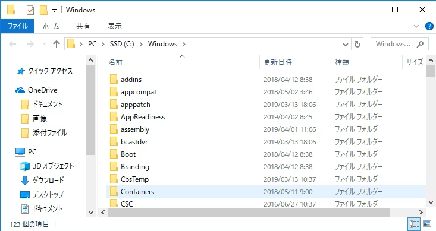
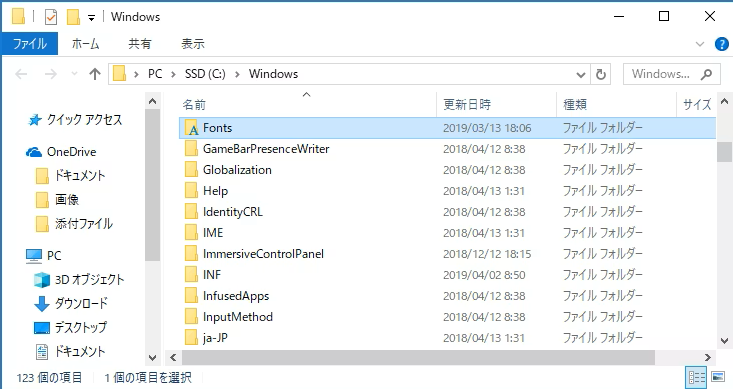
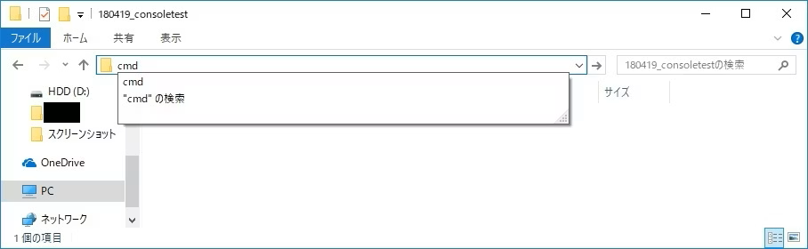
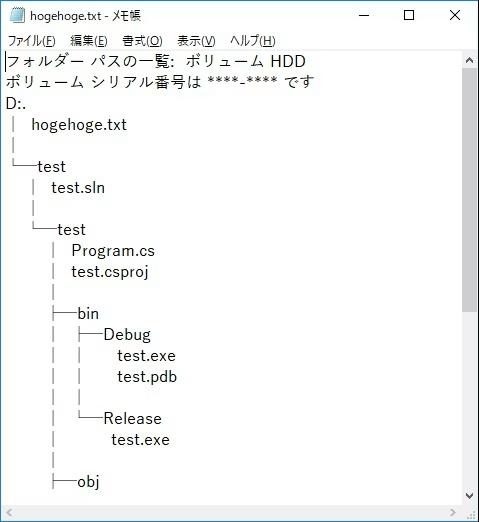
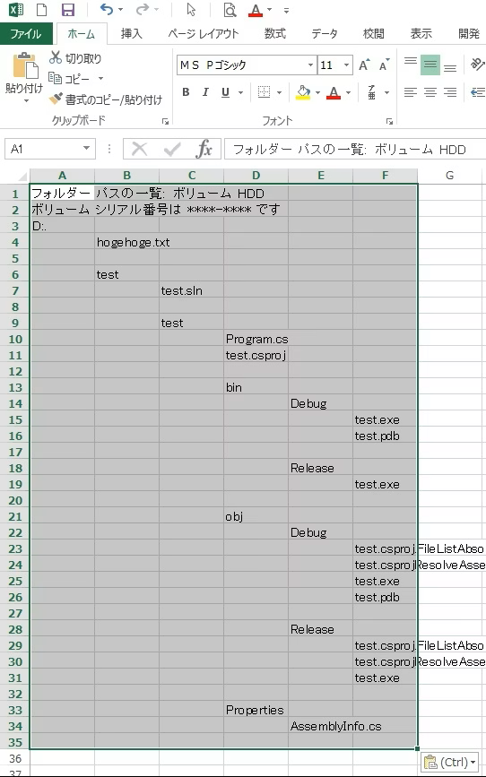

# Windowsでの「データ」操作の小ネタ

Windows上での操作上の小ネタをまとめてみました。

## 連番を固定長形式で切るとWindowsのバージョンによらずきれいに並ぶ

もしかしたら、リポジトリサーバが立ってないプロジェクトに入ったりすることもあるかもしれません。

そんな時に、新旧のファイルを比較できる様、置いておくケースはままあります。

フォルダに以下のようにファイルを置く場合は

```
hogehoge_new.xxx
hogehoge_old.xxx
```

こんな感じで固定長の連番を振るとその連番順にファイルが綺麗に並びます。

```
hogehoge_01_old.xxx
hogehoge_02_new.xxx
```

ちなみに1フォルダに複数の階層を持ったフォルダを一気におきたいときは

```
01_sushiPJ_01_基本設計
01_sushiPJ_02_詳細設計
02_yakinikuPJ_01_基本設計
02_yakinikuPJ_02_詳細設計
```

みたいな命名ルールにすると綺麗に並びます。

なお、そもそもフォルダで管理するのがイケてないという説はあるわけですが、エンドユーザサポートで月1人日のサポート工数とかだったりするとリポジトリサーバなんかわざわざ立ててらんない事情とかありますよね……　(実際あった)。

## ファイルを探せない時に検索を使わずに探せる方法がある

Windowsは英語圏の人が簡単に操作できる様に最適化されている節があり、フォルダのなかの何かのファイルを選択した後、ファイル名(ないしフォルダ名)を打つとそのファイル、フォルダに移動する動きになります(前一致で検索がかかる)。

なお、日本語でもいけるけど操作の時間制限が厳しいのと全角文字がきっちりあわないと行ってくれないけどやってみる価値はあるかもしれない。(検索機能よりは圧倒的に早いので当たればラッキー！的な。)

なお、さっきのトピックと混ぜて、頭に連番とかyymmdd形式の日付を振ったりして高速引きする手法も強いです。

以下に、実際の例を示してみます。

例えばWindowsのフォルダ(c:\Windows)で、



IME(MS-IMEとかGoogle日本語入力とかAtok)とかをOffにして、半角英数字が入力されるモードにしてFを押したら



こうなります(なおそのまま2文字目の文字を打つとその2文字目があるフォルダに飛びます)。

## ディレクトリツリー図をWindows標準機能だけで簡単にExcelに起こす

ディレクトリのツリー図は、次のような手順で簡単に起こせます。

### ディレクトリツリーを起こしたい起点でCMDコマンドの実行

こんな感じ。



### コマンドプロンプト画面でtreeコマンドの実行

出力先はどこでも大丈夫です（とりあえず同フォルダにしていますが）。

```
tree -f > hogehoge.txt
```

### エディタで置換(あえてメモ帳でやってますがなんでもいいです)



そこで、以下の置換を順に実行しましょう。

* "│" → "  "(※半角スペース2つ)
* "└" → "  "(※半角スペース2つ)
* "─" → "  "(※半角スペース2つ)
* "├" → "  "(※半角スペース2つ)
* "    "(※半角スペース4つ) → タブ１つ(メモ帳の場合はタブを置換ウインドウにコピペ)

### Excelに貼る

先のテキストを全文コピーしてExcelに貼ると……



という形になります。

これらをうまく使うと、Windows上でのファイルのマネジメントが少し楽になるかもしれません。
