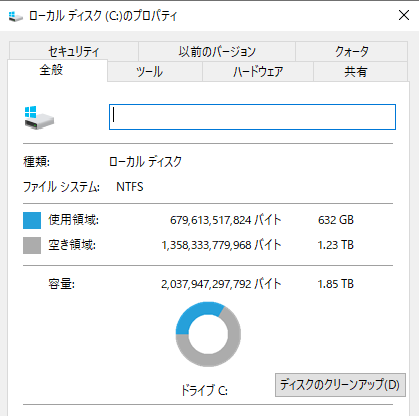

# Cドライブの空容量を増やす

FORTE(フォルテ)@FORTEgp05

本章の執筆をしましたFORTE(フォルテ)と申します。長く同じWindowsPCを使っているとCドライブの空容量が少なくなりませんか？私は少なくなりました。2017年に購入したデスクトップのゲーミングPCだったのですが、当時はまだM.2 SSDの価格が高く金額をおさえるためにCドライブの容量を256GBにしました(それでもプラス1万円)

これがケチの始まりでした。

## 度重なるアップデートに容量が足りなくなる
当時は「Cドライブなんてそんなに使わない、OSと速度が必要なゲームのみだし」と思っていました。しかし、そのOSと速度が必要なゲームで256GB使いきってしまいました。速度が必要なゲームといっても2本だけです。FF14とDQX、つまりMMO2本だけ。他のゲームはすべてHDDに入れていました。それでも空き容量がなくなってしまいました。

2023年の年初で、だいたいOS(Windows10)とMMOで256GBを半分ずつ使っている状況でした。Windows10もアップデートのたびに使用容量が増えていきますが、 MMO2本は拡張パッケージ販売のたびに数GB〜数十GBずつ増えていきます。そして20242024年はその拡張パッケージの発売が予定されていました。2本とも。

このまままではCドライブの容量が足らなくなるということで、PCの買い替えを含め対応策の検討を始めます。

## Cドライブだけ容量を増やして解決する
いまと違い2023年当時はお金にまだ余裕がありましたが、ゲーミングPCを買うにはタイミングが悪かったと思います。GPUの値段は高騰する一方であり、またプレイしているMMOが10年前発売ということもあり、そこまでハイスペックなGPUは不要でした。

また2024年の拡張パッケージの情報が出揃っておらず、2023年にお金をかけてGPUを含めてPCを新調しても過不足がでる可能性があります。PCパーツの交換なら後戻りできますが、PC本体を買い替えてしまったら後戻りできません。

そのため、パーツ交換で済む方法を探し、SSDだけ大容量のものに交換しデータはディスクイメージを取って移行する方法としました。

### 作業内容
まず引っ越し先となる今よりも大容量のSSDを購入します。大容量ならなんでもよいというわけではなく、イメージを書き戻すことを考えるとメーカーやシリーズが異なるとドライバの問題などが出そうです。そのため、今回は移行元のSSDと同じメーカー同じシリーズの大容量版を購入しました。

[購入したSSDのASCIIによるレビュー記事](https://ascii.jp/elem/000/004/057/4057945/)

次に現在Cドライブとして使用しているSSDからディスクイメージをとり、新しく購入した大容量のSSDに書き込みます。これにはフリーのバックアップツールを使用しました。

これはいわゆるイメージバックアップと呼ばれるもので、そのディスク(パーティション)単位にデータをクローンしイメージと呼ばれるデータにします。本来このイメージはバックアップ用のもので、ディスクになにかあったときに別のディスクに書き戻してデータを復旧するためのものです。今回はそれをデータ移行用に利用しました。

最後にPC内のSSDを購入した大容量のものに交換して動作確認を行います。

### 必要なもの
次に必要なものを記載します。

 - 移行先の大容量SSD
    - Intel SSD 670p M.2 2TB
 - M.2 SSDをUSBでPC接続可能な外付けケース
    - ELUTENG M.2 SSD 外付けケース
 - イメージバックアップ可能なフリーソフト
    - Minitool Shadowmaker

新しいSSDは2023年当時ドスパラの通販で1万円ほとでした。2017年当時に128GB容量を増やすのに1万円かかったことを考えると安くなってます。

外付けケースはAmazonで3千円ほどで購入しました。一緒にM.2 SSD用のヒートシンクも購入しましたが、これは任意となります。私のPCにはもともとヒートシンクがついており、交換時にヒートシンクは使いまわせなかったので新しく購入しました。ヒートシンクは7百円程度でした。

なお、もしマザーボードに追加でM.2 SSDが接続できるのなら外付けケースは不要だと思います。私はM.2 SSD用のソケットが1個しかなかったので購入しましたが、複数あるのならそれぞれ接続してバックアップ可能だと思います。

最後にディスクイメージを取得するためにMinitool Shadowmakerというソフトを使用します。筆者が作業した当時は無料版で問題ありませんでしたが、ライセンスの状況が変わっていることがあるので必ず確認してください。有料版なら確実かと思います。

## 実際にやってみる
それではやってみましょう。

### 新しいSSDを外付けケースなどでPCに接続する
これは購入した外付けケースの説明書の通りにやればいいのですが、イメージバックアップ時に対象のドライブとして判別できるようにしておきます。具体的にはPCに接続して利用可能状態にするために未割り当て領域を初期化する際、ドライブレター(CとかDとかのやつ)を控えておきましょう。

もし初期化の方法などがわからなければ適宜ググってください。

### Minitool Shadowmakerのダウンロードとインストール
次にMinitool Shadowmakerをダウンロードします。

公式サイトhttps://jp.minitool.com/backup/shadowmaker-pro.htmlからダウンロード可能です。丈夫メニューのダウンロードからShadowmakerをダウンロードしましょう。

インストールは特に注意点などなく、次へ次へでOKです。

### ディスクイメージを取る
では、Shadowmakerを使用してディスクイメージを取ります。バージョンにもよりますが、ToolsのClone Diskからイメージバックアップします。このときバックアップ元のディスクとしてCドライブを、バックアップ先のディスクとして接続した大容量のディスクを選択しますが、くれぐれも間違えないようにしましょう。

ここでさきほど確認したドライブレターが役立ちます。あとは容量なども出ると思いますので、確認しつつ進めましょう。

クローンが完了したらPCの電源を切ります。

### SSDを差し替えて動作確認
PCの電源を切り、電源ケーブルも抜いたらSSDを差し替えます。もしヒートシンクを装着するならこのときに着けます。SSDの交換方法についてもマザーボードやSSDによって異なるので適宜ググってください。

SSDを差し替えたら電源ケーブルを接続し起動します。ちゃんと起動してくれば一安心。エクスプローラなどでCドライブの空容量を確認し増えていることを確認しましょう。

もし起動しなくても慌てなくて大丈夫です。落ち着いて元のSSDに戻して起動すればちゃんと起動するはずです。交換したSSDで起動しない理由は元に戻してからゆっくり調べれば大丈夫です。

## 2年経った結果
私はこの作業を2023年夏に行いました。執筆している2025年3月の時点で1年半以上経っていますが、問題はありません。むしろSSDにMMO以外のゲームも入れられるようになったので、QOLが上がった気がします。

費用としては1万5千円弱でCドライブの空容量を劇的に増やせたので良い買い物だったと思います。

## おわりに
自分にはデータ管理なんて専門的なことは書けないと思っていましたが、ちょっと工夫したことでも1章書けるものですね。特にバックアップについてはずっと悩んでいるので他の著者の方の寄稿が楽しみです。

もしあなたもそれくらいならと思うのであれば、ぜひめくるめく執筆の世界へ。一緒に締め切りを作りましょう！
