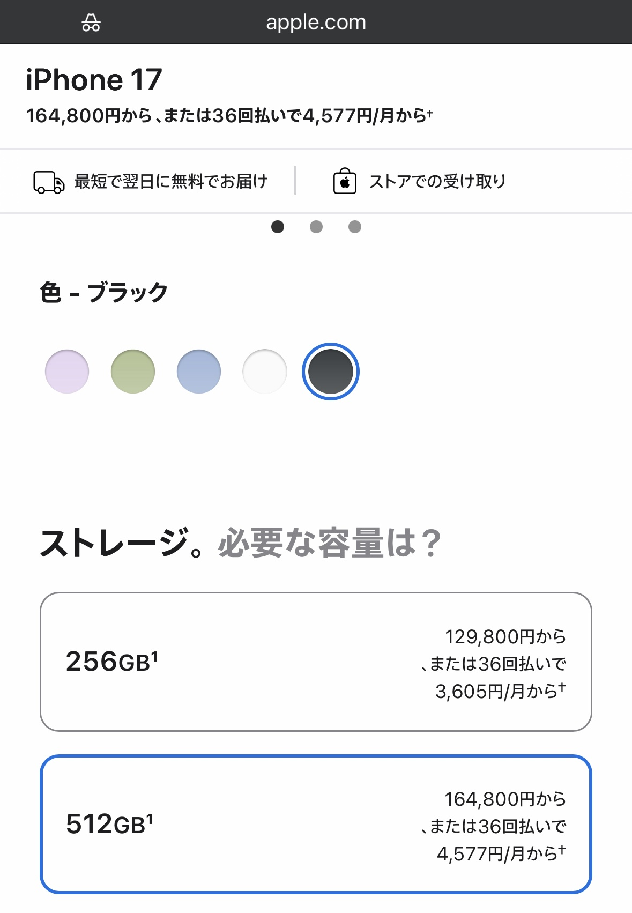

# iPhone空き容量をiCloudで増やす

FORTE(フォルテ)@FORTEgp05

執筆者のFORTE（フォルテ）です。

iPhone使いの皆さん、空き容量はいかがですか？  切羽詰まっていませんか？？本章ではiCloudを使って3万5千円を月コーヒー一杯（150円）で解決しつつ、容量を食いがちな写真のバックアップも何も考えずにできる方法を紹介します。

## iPhoneストレージではダメなのか？
執筆時点でApple StoreのiPhone17の価格を見ると、256GBと512GBでは3万5千円の差があります。

[Apple Store](https://www.apple.com/jp/shop/buy-iphone/iphone-17)

単純にストレージ「だけ」に3万5千円と言うのは高いです。しかもストレージが増えるだけなのでバックアップはしてくれません。それは自己責任です。

しかしiCloudなら200GBが450円であり年間でも5,400円、5年使っても27,000円なのでまだ安いです。さらにここにバックアップもついてきますし、追加で簡単に容量も増やせます。

### 本体の買い替えは難しい

本体はそう簡単に買い替えできませんし、買ったら10万円以上です。またこの価格は現在の価格です。半導体価格が上がっている昨今を鑑みると、5年後は3万5千円で容量2倍にはならないかもしれません。

というわけでこの章ではiCloudをお勧めしています。

## iCloudのメリット
次にiCloudのメリットを挙げます。

- お手持ちのiPhoneから簡単にすぐ導入可能
- 体験の良い画像バックアップ付き（オフも可）
- 他の端末から写真以外のデータ参照可能

ひとつずつ解説します。

### お手持ちのiPhoneから簡単にすぐ導入可能
iPhoneの設定画面からiCloudを選択すればその場でサブスクリプション可能です。最低金額は50GBで150円/月です。ショップなどにいく必要はないですし、ヤバい！容量が足りない！となったその場で導入してデータを移動すれば容量を増やせます。

#### 手軽さが良い理由

この手軽さの何が良いかと言うと、データの要否判断を大量にする必要がないと言う点です。今すぐ空き容量が欲しい時に写真や動画、アプリのデータを一個ずつ確認して空き容量を増やすのは苦痛です。忙しい現代人なら尚更です。

それならとりあえず150円で50GBを1ヶ月借りてデータを退避、その場を凌いでから後でゆっくりネトフリでもに見ながらデータ要否を判断すれば良いのです。

### 体験の良い画像バックアップ付き（オフも可）
個人的にiPhoneで最も容量を食っているのが写真アプリに格納された写真や動画です。筆者はそんなに写真を撮る方ではなく、また不要な写真は消していますが、それでも36GBを写真アプリで使用しています。

#### 写真アプリの容量が大きい理由
これはiPhoneを使い始めた15年前からの写真をずっと引き継いでいるため、このサイズになっています。正直15年前の写真は不要なのですが、それは今不要なだけで30年後は分かりません。いま思う15年前の写真の価値と今から30年後に思う45年前の写真の価値は比べられないでしょう。

写真というものは写っているもの以上にその古さに価値があるように思います。そして古ければ古いほどバックアップや要否判断の管理が面倒さが増えます。そこでiCloudを使うとiPhone本体にはサイズの小さいサムネ画像だけ保存されサイズが大きい画像本体はiCloudに保存されます。

#### 写真アプリとiCloud

特定の写真にアクセスするとiCloudから元の画像が勝手にダウンロードされ表示されますが、アクセスが無いと本体から自動で消されて容量が空きます。またiCloudへのアップロードもWi-Fiでのみ実行する設定ができるため、設定さえすればiCloud導入後に突然通信量が増えると言うことはほぼありません（普段アクセスしない画像に大量にアクセスすると増えますが1、2枚なら影響ありません）

このように正しく設定すれば何も意識せず勝手にクラウドへバックアップされ、しかも最近写真は本体に、閲覧してない画像はクラウドにあるため効率よく容量を節約できます。

### 他の端末から写真以外のデータも参照可能
iCloudでは写真アプリ以外にPDFなどのファイル、メモ、パスワードなどもバックアップ可能です。これらの容量は人によって異なりますが、クラウドにアップされることで利便性は増します。写真もそうですが、iPhone内にあるデータをいちいち転送しなくてもiCloudにアクセスすれば取得可能です。

#### Windowsとの共有も便利
筆者はPCゲームをやるためメインPCはWindowsですが、執筆やプログラミングはMacBookで作業しており、コンテンツ閲覧にiPad、スマホはiPhoneです。そのため、最近はスマホとPCで同じゲームができるたりゲームやそれ以外のサービスにiCloudパスワードで一にログインできたりするのは非常に便利です。

## 実際にiCloudバックアップにしてみて
筆者はiCloudバックアップにして半年ほど経っていますが、まったく困っていません。また自宅でWi-Fi接続時に写真のバックアップが自動で走るため、写真アプリについてはバックアップを取らなきゃと思うことは無くなりました。逆に言えばそれまではデータを飛ばした事があるため、バックアップにはナイーブになっていました。

### データ移行に失敗した話
実は今のiPhoneに変える時、前のiPhoneが突然壊れてタッチできなくなりデータのバックアップも転送ができなかったのです。そのため2〜3ヶ月前の古いバックアップから移行したため、ちょうど一昨年の夏の写真がごっそり無くなってしまいました。ちょうどその時しかないイベントの写真だったため非常に残念な思いをしました。しかし、今はバックアップに駆られることはありません。

そうiCloudならね。

## さいごに
執筆時点で筆者のiCloud容量は残り13/50GB程度です。このまま行けば容量が足りなくなりますが、そうなったらPCからiCloudの古い写真をダウンロードしてiCloudから削除し空き容量を増やします。

そうすると古い写真が見れなくなりますが、日常で見ることはないですし、どうしても見たくなったらiCloudに戻しても良いですし、iCloudの容量を増やしても良いですし、NASなどを用いて部屋のHDDに入ってる画像にアクセスできるようにすることもできます。

その時の手間と費用を考えて選ぶ事ができますが、本体の容量を増やすと選ぶことはできません。そのため、iCloudという入れ物は今の自分に合っているなと思っています。恐らくデータ管理に絶対の正解はないのでしょう。

この章があなたのデータ管理ライフに役立ったのなら、こんなに嬉しいことはありません。
