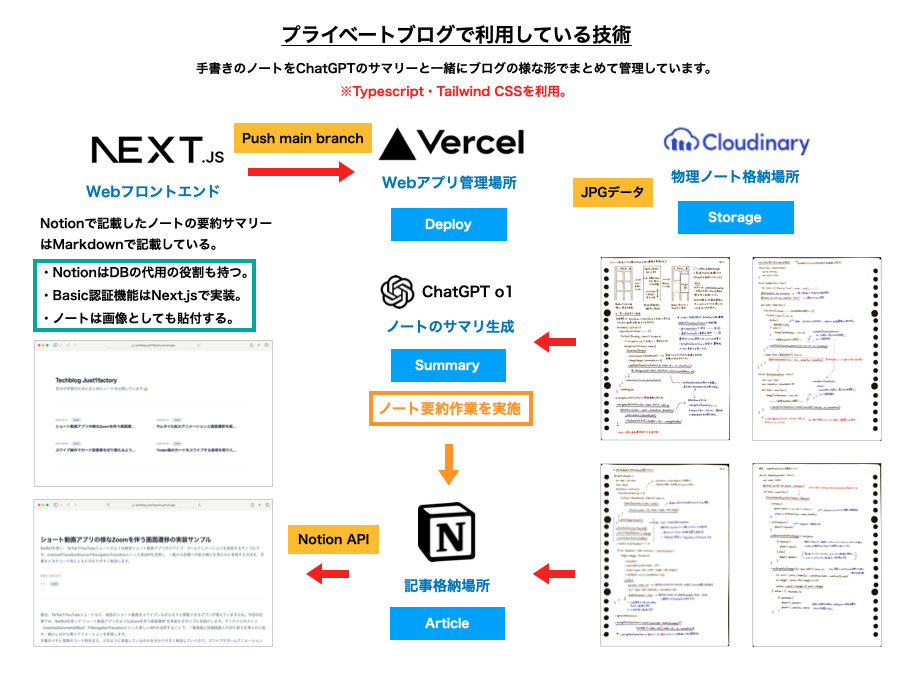
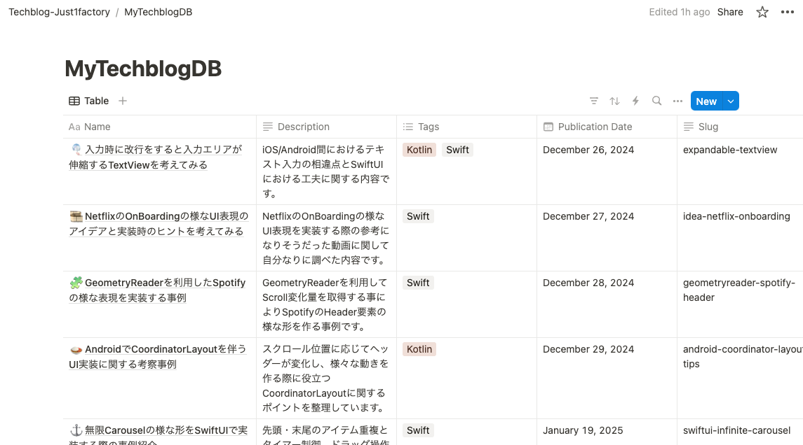
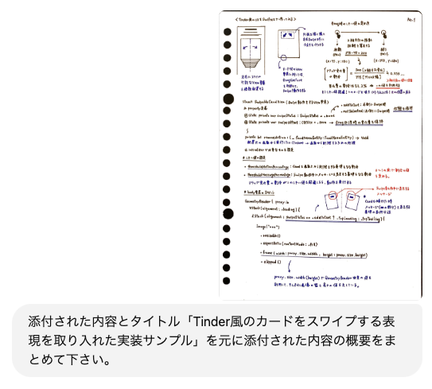
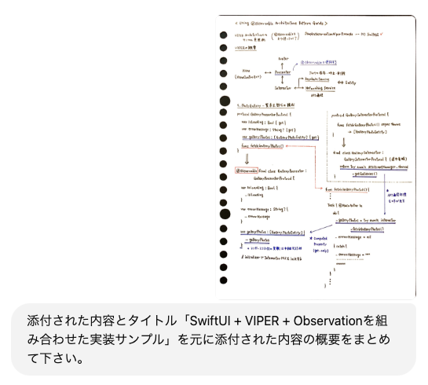

# プライベートブログとしてのアウトプット管理

## はじめに

私自身、技術的なトピックを学ぶ際には、まず手書きのノートを使って情報を整理することを習慣としています。書籍やサンプルコード、動画教材など、多岐にわたる情報源から得た知識を、自分の言葉や図解を交えてノートにまとめることで、表面的な理解にとどまらず、より深いところまで踏み込んだ知識を獲得できると考えているからです。

ノートの内容は、ただファイリングしておくだけではもったいないので、プライベートブログにまとめるようにもしています。その際、生成AIを活用してノートの要点をサマリー化し、わかりやすく整理しておくことで、あとから復習しやすい形に仕上げています。本書では、こうした「ノートを活用した学習法」や「生成AIを取り入れた知識整理」の実践的なアプローチを紹介し、みなさまの学習や情報整理に役立つアイデアをお伝えできればと考えています。

日頃から自分用のノートをまとめるだけでなく、プライベートブログも自作しています。もっとも、ブログといってもWordPressなどの既存サービスは使わず、シンプルなWebページを一から制作するスタイルです。こうすることで、自分の学習内容を自由に整理し、必要に応じて構成を変えられるようにしています。

### 平素からまとめているノート例

## プライベートブログ技術構成と定型作業

では、手書きのノートの内容をまとめたプライベートブログの構成を簡単に紹介します。

### プライベートブログの技術スタック

- Web Frontend: Next.js[^1]
- DB: Notion[^2]
- Summary: Chat GPT o1
- Storage: Cloudinary[^3]
- Deploy: Vercel[^4]

[^1]: https://nextjs.org/
[^2]: https://www.notion.com/ja
[^3]: https://cloudinary.com/
[^4]: https://vercel.com

技術スタックを選定する際、自分がこれから伸ばしていきたい技術を試してみたいという思いがありました。そのため、業務で少しだけ触れた経験のあるNext.jsを使って、ゼロから簡単な個人ブログのような形のサイトを作ろうと考えました。

また、Next.jsには、個人ブログとして立ち上げたものを将来的に機能拡張したり、一部だけ公開したりする際の柔軟性がある点も大きな魅力だと感じています。さらに、バックエンドにNotionを利用しながら、フロントエンドを自由にコントロールできるため、データ管理の面でも理想的なソリューションになると思います。

### NotionをバックエンドDBの代わりとして利用する

Notionが持つ「構造化されたデータ」と「柔軟なドキュメント」の両面性を活かすことで、伝統的なCMSやブログシステムに比べて、記事をよりシンプルに扱えるように感じます。さらに、Next.jsと組み合わせることで、コンテンツ管理の柔軟性とフロントエンドの自由度を同時に実現できる可能性が高いと考えました。

### サマリー文章を「ChatGPT o1」を利用して出力する

このブログの執筆手順は下記の様な流れで行っています。

1. 気になる手書きノートを記述する。
2. 手書きノートをスマートフォンのカメラで撮影[^5]し、そのデータをCloudinaryへアップロードする。
3. 手書きノートの内容に関するサマリー文章を「ChatGPT o1」を利用して出力する。
4. これまでの内容をNotionにまとめる。
5. 内容がまとまったらVercelへデプロイする。

特に、3番目の手順では「ChatGPT o1」で下記の様なプロンプトを実行することで、手書きノートの画像に記された内容の概要を出力しています。

前ページで紹介したノートの内容におけるサマリー出力結果例はこの様になります（入力するプロンプト次第では出力結果が異なる場合もあり得ます）。

#### 手書きノートの内容サマリー出力例(1)

__【出力された内容サマリーはこちら】__

これらのノートは、「Tinder風のカードをスワイプする表現をSwiftUIで実装する際のポイント」をまとめたものです。主に以下の内容が記載されています。

- **スワイプ操作の管理**
  - カードに適用するDragGestureの実装方法
  - スワイプ方向（左右）に応じた状態（`addToCart`/`notSelected`など）の更新
  - `thresholdActionPercentage`や`thresholdMessagePercentage`といった閾値により、スワイプ結果を判定する仕組み
- **アニメーションとレイアウト**
  - `GeometryReader`を使ったカードの配置やサイズ調整
  - スワイプ量に応じたカードの回転アニメーションやオフセットの設定
  - スワイプ中に表示するメッセージや境界のデザイン
- **カードの削除処理**
  - しきい値を超えた場合に、Closuresを使ってカードをリストから取り除く仕組み

これらを組み合わせることで、Tinderのような直感的で動きのあるカードスワイプUIを実装できるサンプルコードの参考資料となっています。

#### 手書きノートの内容サマリー出力例(2)

__【出力されたサマリー文章はこちら】__

添付された内容は、VIPERアーキテクチャにおいて新たに導入された`@Observable`（Observation）をどのように組み合わせ、SwiftUIと連携させてアプリを実装するかを整理したものです。大きく「写真ギャラリー表示」と「認証（JWTトークン管理）」の２つを例に、Presenter・Interactor・Routerといった各コンポーネントの関係やデータフローが手書きの図を用いて解説されています。

- **VIPER構造の概要**
  - View（SwiftUI / ViewController）からPresenterを介してInteractorへ処理を渡し、API通信や認証のロジックを行う。
  - Routerは画面遷移やルーティングの責務を担う。
  - EntityはAPIのレスポンスやアプリ内のデータ構造を表す。
- **`@Observable`（Observation）の活用**
  - Presenterクラスに@Observableを適用することで、SwiftUIの画面更新（状態管理）と連動させる仕組みを実現。
  - `isLoading`や`errorMessage`など、UIに反映したい状態を@Observableクラスのプロパティとして定義している。
- **具体的な実装例１：PhotoGallery**
  - `GalleryPresenterProtocol`に定義された`isLoading`・`errorMessage`・`galleryPhotos`などの状態を保持・更新。
  - `fetchGalleryPhotos()`メソッドでInteractorを呼び出し、APIクライアントを経由して写真データを取得。
  - 取得結果やエラー状態をPresenterが持ち、SwiftUIのViewにバインドされる。
- **具体的な実装例２：認証（JWT）**
  - `AuthenticationPresenterProtocol`で`isLoading`や`errorMessage`を定義し、ログイン処理とトークン検証処理を提供。
  - Interactor側でAPIクライアントを呼び出しトークンを発行・検証し、Keychainに保存する流れを実装。
  - 成功時にはRouterでメイン画面（TabBar）へ遷移させ、エラー時にはメッセージ表示などの分岐を行う。

これらを通じて、従来のVIPERアーキテクチャでの責務分離と、SwiftUI + `@Observable`によるリアクティブなUI更新とを組み合わせる具体的なイメージが示されています。

#### この取り組みを実践した振り返り

この取り組みは、単なるデジタル化ではなく、アナログとデジタル、人間とAIそれぞれの強みを組み合わせることで、より深い学習と知識管理を実現するハイブリッドアプローチです。特にエンジニアリングなどの技術分野を学ぶ際には、情報をただ管理するだけでなく、多角的に処理・整理することが概念理解の定着に大きく貢献すると考えています。

現在はアナログなプロセスを踏みながらブログ自体を管理していますが、今後はさらに自動化を進めたり、デザインや検索性を向上させたりするなど、さまざまな工夫を取り入れていきたいと考えています。

[^5]: https://support.microsoft.com/ja-jp/office/ios-%E7%89%88-microsoft-lens-fbdca5f4-1b1b-4391-a931-dc1c2582397b

## まとめ

Next.jsの柔軟性と高性能、Notionのハイブリッド的データ構造、生成AIの知識再構成能力、そしてクラウドサービスの安定性と拡張性—これらは単なる利便性を超え、思考と知識の拡張装置として機能します。

個人的なプログラミングプロジェクトとして始めたものが、やがて自分自身の思考プロセスを変革するシステムへと進化する—これこそがエンジニアリングの醍醐味ではないでしょうか。技術を創り、その技術によって自らも変容していく循環的な関係性の中に、持続的な知的成長の可能性があります。

今回のアプローチは、決して完全なソリューションではなく、個人の知的活動を支援するための一つの指針に過ぎません。読者の皆様が、ここで紹介した概念やテクニックを出発点として、自らの学習スタイルや興味に合わせた独自のナレッジシステムを構築されることを心から願っています。

データ管理は単なる技術課題ではなく、私たちが知識と向き合い、それを発展させていく方法そのものなのかもしれませんね。

__【プライベートブログURL】__

https://techblog-just1factory.vercel.app/

- ID: fumiyasac
- PW: iwasbornin19840921
