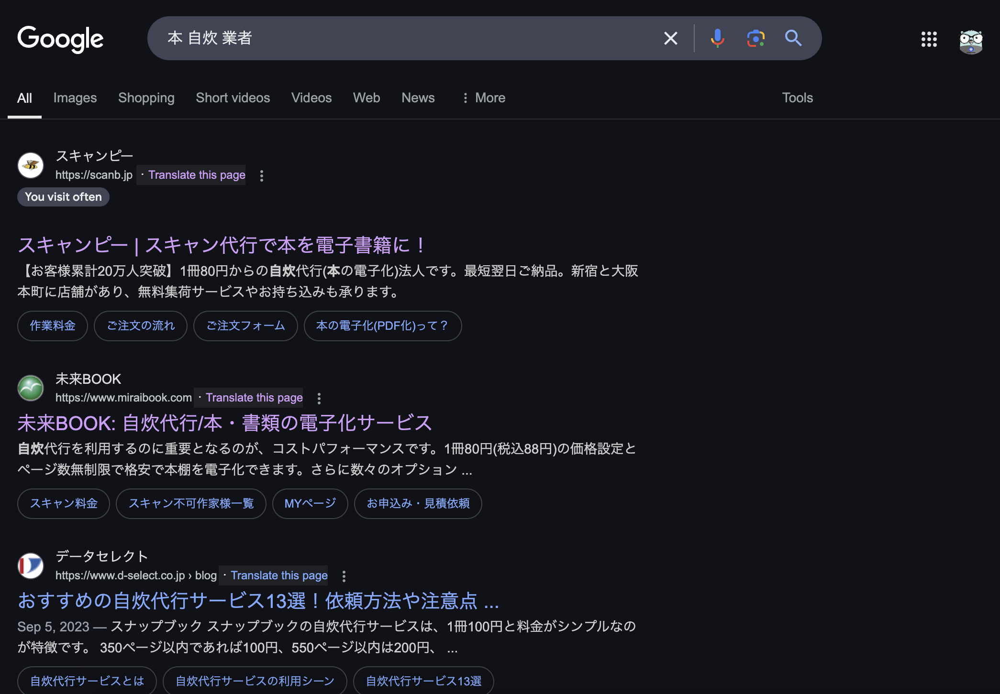

# 増えていく教科書をデータ管理

おかもとゆうすけ@yuusukesan18

学生の頃に教科書を購入し、卒業前にどうしようか悩んだ経験がある人は多いのではないでしょうか。
私も同じような経験を持っています。
大学卒業時には、必要な教科書だけを残し、残りは資源ごみとして処分しました。

現在、放送大学に通っているのですが、一人暮らしの部屋に積み上がる教科書を眺め、どうにかできないかと考えました。
その解決策として思いついたのが、教科書のデータ化です。

今回は、その過程で経験したデータ管理本記事は、私的利用の範囲にてデータ化しました。教科書には、著作権も関連するため、データ化されるときには、個人利用で行いましょう。について、まとめてご紹介します。

## 放送大学の教科書事情

放放送大学では、対面授業を除き、通常の大学のように指定された教科書を生協やAmazonなどで購入するのではなく、学期が始まる前の履修登録で受講科目を登録すると、印刷教材（教科書）が送られてきます。
授業で使用される教科書のページ数は、200ページから300ページ前後です。

この教科書に加えて、教科書で引用された文献を必要に応じて購入することもあります。
放送大学には電子版もありますが、現時点（2025年11月時点）では、障がいのある方のみへの提供となっています。
私自身も以前大学に依頼のメールを送付しましたが、お断りされた経験があります。
当時は仕方ないという気持ちでいましたが、月日が経ち、印刷教材（教科書）が増えるにつれて、どのように管理するか悩むようになりました。

## 印刷教科書の課題
紙の教科書には、書き込みがしにくいという課題がありました。
ちょっとしたメモを書き込みたい、授業を受けて気になったキーワードをメモしておきたい、といったことを行う際に、教科書に気軽に書き込めないという人もいることでしょう。

かくいう私も同様で、教科書に直接書くことに抵抗があり、ノートに書くことが多かったのですが、ノートも増えていき、場所を取るという結果になりました。
最近では、PDFや画像をノートアプリに取り込んで、メモや考えたことなどを走り書きにし、オンライン上に保存するようにしています。
その一環として、教科書も同様の管理をしたいと考えるようになりました。

## データ化の方法

物理的なデータとしてではなく、デジタルデータとして保存することを決めて、電子化について調査を行いました。
以下がデータ化にあたり、整理した要件です。

- PDFにてデータとして保存できること
- データ化の対象は、厳選した印刷教材（教科書）とすること
- データ化にあたり、機材は必要最低限の購入とすること

要件から以下の選択肢を考えました。

- 自宅にてデータ化を行う
- 業者に依頼してデータ化を行う

### 自宅でのデータ化
自宅で教科書を自炊するには、最低でも以下のアイテムが必要となります。

- スキャナ
- 裁断機

新品で購入するとなると、機能にもよりますが、50,000円以上必要となる可能性があります。
もちろん、メルカリなどを利用して中古で購入する、もしくは、これらのアイテムのレンタルサービスを提供している会社を利用する方法もあります。これらを活用するとコストを抑えることができます。

100冊以上の大量の本を電子データ化したい、そして、これらの道具を置ける場所があるという場合には、自宅でのデータ化を選択肢に入れることもできます。

### 業者へのデータ化依頼
50冊程度の場合や、一人暮らしで道具を設置する場所を確保できない場合に活用できるのが、業者へのデータ化依頼です。

東京や大阪には、物理的な本をデータ化するサービスを提供する業者があります。
Google検索で、「本　自炊　業者」というキーワードで検索すると、上位に業者が表示されます。

{width=70%}

これらの業者は、本を裁断、スキャン、データ化、廃棄著作権上、裁断された本は、手元に返還されることなく、廃棄されます。まで行うところがほとんどです。

業者の比較表が、以下になります。

 <figure id="table2">
    <figcaption>筆者調べによる業者比較</figcaption>
    <table>
        <thead>
            <tr>
                <th colspan="3">業者比較表</th>
            </tr>
        </thead>
        <tbody>
            <tr>
                <td rowspan="2">A社</td>
                <td>基本料金</td>
                <td>80円〜/冊(税別)</td>
            </tr>
            <tr>
                <td>有料オプション</td>
                <td>◯</td>
            </tr>
            <tr>
                <td rowspan="2">B社</td>
                <td>基本料金</td>
                <td>165円/冊(税込)</td>
            </tr>
            <tr>
                <td>有料オプション</td>
                <td>○</td>
            </tr>
            <tr>
                <td rowspan="2">C社</td>
                <td>基本料金</td>
                <td>140円/冊(税別)</td>
            </tr>
            <tr>
                <td>有料オプション</td>
                <td>◯</td>
            </tr>
        </tbody>
    </table>
</figure>

### 業者へ依頼した事例
私は、コストを極力抑えたいと考えていたので、持ち込みができるA社へ依頼することにしました。
実際に、教科書を持ち込んだ事例をご紹介します。

持ち込みの場合は、以下のフローで依頼することになりました。

1. 店頭で発注依頼を行う
2. 料金を支払う
3. 納期の確認とQA対応

発注から支払いまで10分もかからずに行うことができました。
納期に関しては、有料オプションとなりました。

今回は、7日で納品されるオプションを追加したので、以下の金額となりました。

合計:550円

内訳:
- 通常注文:264円
    - 300ページまでの書籍:88円(税込)×1冊
    - 301ページ以上の書籍:176円(税込)×1冊 
- 作業納期オプション:110円
    - 55円(税込)×2冊
- OCR処理:176円
    - 88円(税込)×2冊

### 業者からの納品の流れ
納品後は、業者からは、納期までに、以下の項目を含んだメールが送付されます。

- ダウンロードURL
- パスワード
- 注意事項と保存方法

## データのパックアップ対応策

自宅での電子化、業者に依頼しての電子化共に、PDFで管理することがほとんどでしょう。
教科書をデータ化して保存する際におすすめなのが、分散保存です。
データがなくなった時のバックアップ対応をどうするべきか、私の事例も含めてご紹介します。

- ローカルストレージに保存

個人のパソコンのローカルストレージに保存します。
保存先となるSSDやHDDが故障しない限り、問題なく保存できるでしょう。
データバックアップの最初の選択肢になります。

- クラウド上に保存

Googleアカウントを持っている人は、Googleドライブを無料で15GBまで利用できます。
課金をすることで、100GB、もしくは200GBまで拡張できます。
かくいう私もGoogleドライブに保存しています。
また、BoxやDropboxを利用して保存する方もいらっしゃるでしょう。
これらも考慮して、総合的に保存するのがおすすめです。

- SDカードに保存

SDカードへ保存するのも良いでしょう。
SDカード自体に物理的な使用期限はありませんが、書き換え回数が多くなると寿命が短くなると言われています。
保存するだけならば、書き換え回数もさほど多くないので、基本的に長期間の保存にも活用できます。
SDカードも1,000円前後で購入できるため、保存先としてもおすすめです。

- Kindleに連携

移動中に教科書を読むこともあるため、KindleにPDFを送っています。
Kindleのクラウド上に保存されるため、Amazonのアカウントが存在する限りアクセス可能です。
隙間時間に教科書を読むという人には、おすすめのバックアップ先となります。

## まとめ
全ての教科書が電子版で販売されているわけではない現状では、教科書のデータ管理は必須の時代になるでしょう。
今回は、放送大学の教科書（印刷教材）をデータ化して管理する方法についてご紹介しました。
教科書は学びが多い反面、場所を取ることで対応に悩んでいる人も多いでしょう。

今回ご紹介したデータ管理は、あくまで一例にすぎません。
他にも、こんなデータ管理をしているという知見を共有いただける方がいらっしゃれば、Xアカウント（@yuusukesan1018）までご連絡いただけると嬉しいです。
